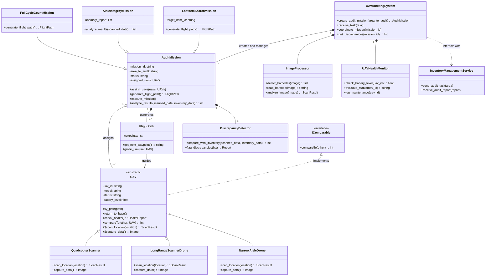

```mermaid
classDiagram
   class UAVAuditingSystem {
       +create_audit_mission(area_to_audit): AuditMission
       +receive_task(task)
       +coordinate_mission(mission_id)
       +get_discrepanices(mission_id): list
   }


   class AuditMission {
       -mission_id: string
       -area_to_audit: string
       -status: string
       -assigned_uavs: UAVs
       +assign_uavs(uavs: UAVs)
       +generate_flight_path(): FlightPath
       +execute_mission()
       +analyze_results(scanned_data, inventory_data): list
   }


   FullCycleCountMission --|> AuditMission
   AisleIntegrityMission --|> AuditMission
   LostItemSearchMission --|> AuditMission


   class FullCycleCountMission {
       +generate_flight_path(): FlightPath
   }
   class AisleIntegrityMission {
       -anomaly_report: list
       +analyze_results(scanned_data): list
   }
   class LostItemSearchMission {
       -target_item_id: string
       +generate_flight_path(): FlightPath
   }


   class IComparable {
       <<interface>>
       +compareTo(other): int
   }


   class UAV {
       <<abstract>>
       -uav_id: string
       -model: string
       -status: string
       -battery_level: float
       +fly_path(path)
       +return_to_base()
       +check_health(): HealthReport
       +compareTo(other: UAV): int
       +$scan_location(location): ScanResult
       +$capture_data(): Image
   }


   class QuadcopterScanner {
       +scan_location(location): ScanResult
       +capture_data(): Image
   }
   class LongRangeScannerDrone {
       +scan_location(location): ScanResult
       +capture_data(): Image
   }
   class NarrowAisleDrone {
       +scan_location(location): ScanResult
       +capture_data(): Image
   }


   class FlightPath {
       -waypoints: list
       +get_next_waypoint(): string
       +guide_uav(uav: UAV)
   }


   class ImageProcessor {
       +detect_barcodes(image): list
       +read_barcode(image): string
       +analyze_image(image): ScanResult
   }


   class DiscrepancyDetector {
       +compare_with_inventory(scanned_data, inventory_data): list
       +flag_discrepancies(list): Report
   }


   class UAVHealthMonitor {
       +check_battery_level(uav_id): float
       +evaluate_status(uav_id): string
       +log_maintenance(uav_id)
   }


   class InventoryManagementService {
       +send_audit_task(area)
       +receive_audit_report(report)
   }


   %% --- Relationships ---
   UAVAuditingSystem "1" *-- "*" AuditMission : creates and manages
   UAVAuditingSystem "1" *-- "1" UAVHealthMonitor
   UAVAuditingSystem "1" *-- "1" ImageProcessor
   AuditMission "1" *-- "1..*" FlightPath : generates
   AuditMission "1" *-- "1" DiscrepancyDetector
   AuditMission "1" o-- "1..*" UAV : assigns
   FlightPath --> UAV : guides
   UAVAuditingSystem ..> InventoryManagementService : interacts with


   %% --- Inheritance and Implementation ---
   UAV <|-- QuadcopterScanner
   UAV <|-- LongRangeScannerDrone
   UAV <|-- NarrowAisleDrone
   IComparable <|.. UAV : implements
```