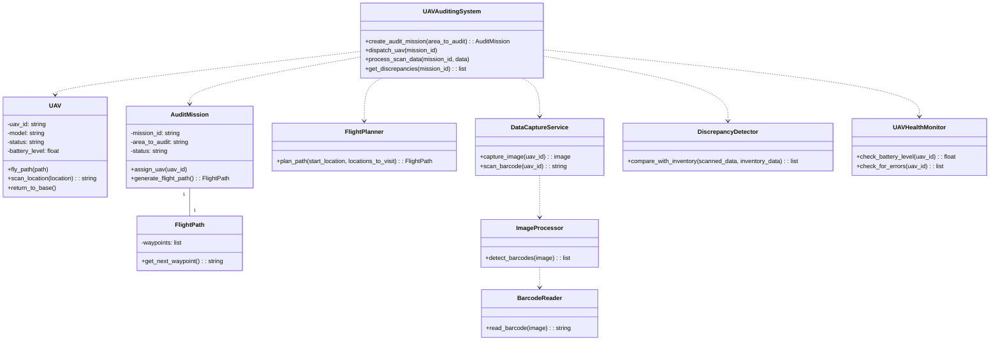

```mermaid
classDiagram
    class UAVAuditingSystem {
        +create_audit_mission(area_to_audit): AuditMission
        +dispatch_uav(mission_id)
        +process_scan_data(mission_id, data)
        +get_discrepancies(mission_id): list
    }
    class UAV {
        -uav_id: string
        -model: string
        -status: string
        -battery_level: float
        +fly_path(path)
        +scan_location(location): string
        +return_to_base()
    }
    class AuditMission {
        -mission_id: string
        -area_to_audit: string
        -status: string
        +assign_uav(uav_id)
        +generate_flight_path(): FlightPath
    }
    class FlightPlanner {
        +plan_path(start_location, locations_to_visit): FlightPath
    }
    class FlightPath {
        -waypoints: list
        +get_next_waypoint(): string
    }
    class DataCaptureService {
        +capture_image(uav_id): image
        +scan_barcode(uav_id): string
    }
    class ImageProcessor {
        +detect_barcodes(image): list
    }
    class BarcodeReader {
        +read_barcode(image): string
    }
    class DiscrepancyDetector {
        +compare_with_inventory(scanned_data, inventory_data): list
    }
    class UAVHealthMonitor {
        +check_battery_level(uav_id): float
        +check_for_errors(uav_id): list
    }
    UAVAuditingSystem ..> UAV
    UAVAuditingSystem ..> AuditMission
    UAVAuditingSystem ..> FlightPlanner
    UAVAuditingSystem ..> DataCaptureService
    UAVAuditingSystem ..> DiscrepancyDetector
    UAVAuditingSystem ..> UAVHealthMonitor
    AuditMission "1" -- "1" FlightPath
    DataCaptureService ..> ImageProcessor
    ImageProcessor ..> BarcodeReader
```