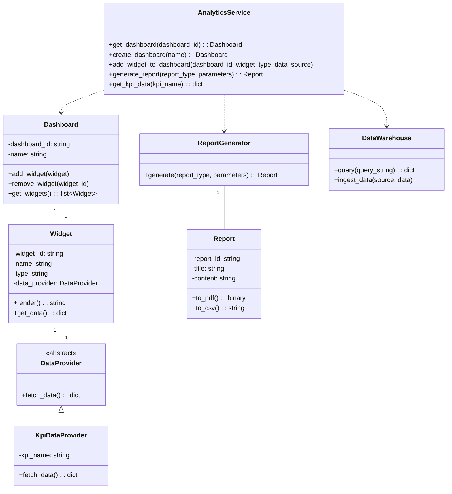

```mermaid
classDiagram
    class AnalyticsService {
        +get_dashboard(dashboard_id): Dashboard
        +create_dashboard(name): Dashboard
        +add_widget_to_dashboard(dashboard_id, widget_type, data_source)
        +generate_report(report_type, parameters): Report
        +get_kpi_data(kpi_name): dict
    }
    class Dashboard {
        -dashboard_id: string
        -name: string
        +add_widget(widget)
        +remove_widget(widget_id)
        +get_widgets(): list~Widget~
    }
    class Widget {
        -widget_id: string
        -name: string
        -type: string
        -data_provider: DataProvider
        +render(): string
        +get_data(): dict
    }
    class DataProvider {
        <<abstract>>
        +fetch_data(): dict
    }
    class KpiDataProvider {
        -kpi_name: string
        +fetch_data(): dict
    }
    class ReportGenerator {
        +generate(report_type, parameters): Report
    }
    class Report {
        -report_id: string
        -title: string
        -content: string
        +to_pdf(): binary
        +to_csv(): string
    }
    class DataWarehouse {
        +query(query_string): dict
        +ingest_data(source, data)
    }
    AnalyticsService ..> Dashboard
    AnalyticsService ..> ReportGenerator
    AnalyticsService ..> DataWarehouse
    Dashboard "1" -- "*" Widget
    Widget "1" -- "1" DataProvider
    DataProvider <|-- KpiDataProvider
    ReportGenerator "1" -- "*" Report
```