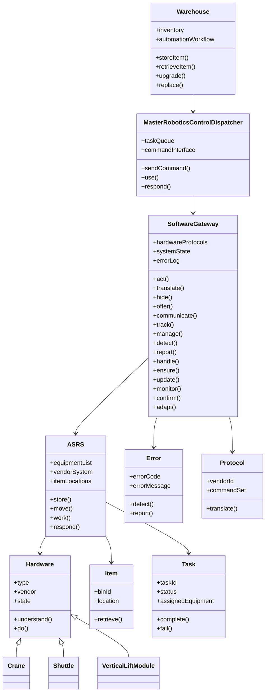

```mermaid
classDiagram
    class Warehouse {
        +inventory
        +automationWorkflow
        +storeItem()
        +retrieveItem()
        +upgrade()
        +replace()
    }

    class MasterRoboticsControlDispatcher {
        +taskQueue
        +commandInterface
        +sendCommand()
        +use()
        +respond()
    }

    class SoftwareGateway {
        +hardwareProtocols
        +systemState
        +errorLog
        +act()
        +translate()
        +hide()
        +offer()
        +communicate()
        +track()
        +manage()
        +detect()
        +report()
        +handle()
        +ensure()
        +update()
        +monitor()
        +confirm()
        +adapt()
    }

    class ASRS {
        +equipmentList
        +vendorSystem
        +itemLocations
        +store()
        +move()
        +work()
        +respond()
    }

    class Hardware {
        +type
        +vendor
        +state
        +understand()
        +do()
    }

    class Crane
    class Shuttle
    class VerticalLiftModule

    class Item {
        +binId
        +location
        +retrieve()
    }

    class Task {
        +taskId
        +status
        +assignedEquipment
        +complete()
        +fail()
    }

    class Error {
        +errorCode
        +errorMessage
        +detect()
        +report()
    }

    class Protocol {
        +vendorId
        +commandSet
        +translate()
    }

    %% Relationships
    Warehouse --> MasterRoboticsControlDispatcher
    MasterRoboticsControlDispatcher --> SoftwareGateway
    SoftwareGateway --> ASRS
    ASRS --> Hardware
    Hardware <|-- Crane
    Hardware <|-- Shuttle
    Hardware <|-- VerticalLiftModule
    ASRS --> Item
    ASRS --> Task
    SoftwareGateway --> Error
    SoftwareGateway --> Protocol

```
