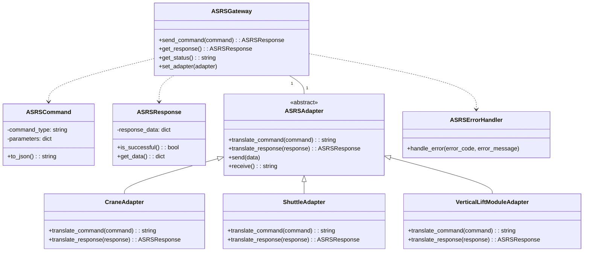

```mermaid
classDiagram
    class ASRSGateway {
        +send_command(command): ASRSResponse
        +get_response(): ASRSResponse
        +get_status(): string
        +set_adapter(adapter)
    }
    class ASRSCommand {
        -command_type: string
        -parameters: dict
        +to_json(): string
    }
    class ASRSResponse {
        -response_data: dict
        +is_successful(): bool
        +get_data(): dict
    }
    class ASRSAdapter {
        <<abstract>>
        +translate_command(command): string
        +translate_response(response): ASRSResponse
        +send(data)
        +receive(): string
    }
    class CraneAdapter {
        +translate_command(command): string
        +translate_response(response): ASRSResponse
    }
    class ShuttleAdapter {
        +translate_command(command): string
        +translate_response(response): ASRSResponse
    }
    class VerticalLiftModuleAdapter {
        +translate_command(command): string
        +translate_response(response): ASRSResponse
    }
    class ASRSErrorHandler {
        +handle_error(error_code, error_message)
    }
    ASRSGateway ..> ASRSCommand
    ASRSGateway ..> ASRSResponse
    ASRSGateway "1" -- "1" ASRSAdapter
    ASRSGateway ..> ASRSErrorHandler
    ASRSAdapter <|-- CraneAdapter
    ASRSAdapter <|-- ShuttleAdapter
    ASRSAdapter <|-- VerticalLiftModuleAdapter
```