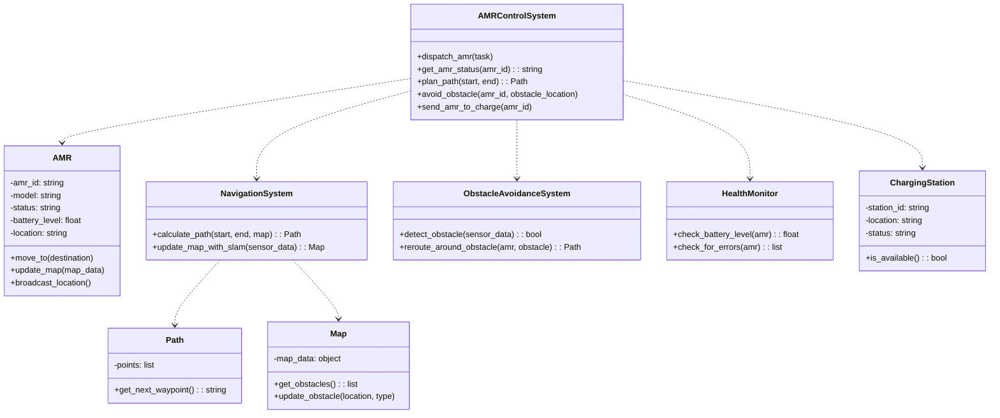

```mermaid
classDiagram
    class AMRControlSystem {
        +dispatch_amr(task)
        +get_amr_status(amr_id): string
        +plan_path(start, end): Path
        +avoid_obstacle(amr_id, obstacle_location)
        +send_amr_to_charge(amr_id)
    }
    class AMR {
        -amr_id: string
        -model: string
        -status: string
        -battery_level: float
        -location: string
        +move_to(destination)
        +update_map(map_data)
        +broadcast_location()
    }
    class NavigationSystem {
        +calculate_path(start, end, map): Path
        +update_map_with_slam(sensor_data): Map
    }
    class Path {
        -points: list
        +get_next_waypoint(): string
    }
    class Map {
        -map_data: object
        +get_obstacles(): list
        +update_obstacle(location, type)
    }
    class ObstacleAvoidanceSystem {
        +detect_obstacle(sensor_data): bool
        +reroute_around_obstacle(amr, obstacle): Path
    }
    class HealthMonitor {
        +check_battery_level(amr): float
        +check_for_errors(amr): list
    }
    class ChargingStation {
        -station_id: string
        -location: string
        -status: string
        +is_available(): bool
    }
    AMRControlSystem ..> AMR
    AMRControlSystem ..> NavigationSystem
    AMRControlSystem ..> ObstacleAvoidanceSystem
    AMRControlSystem ..> HealthMonitor
    AMRControlSystem ..> ChargingStation
    NavigationSystem ..> Path
    NavigationSystem ..> Map
```