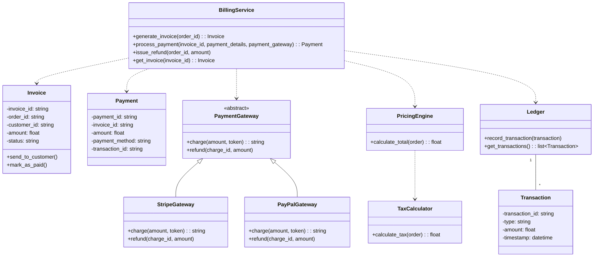

```mermaid
classDiagram
    class BillingService {
        +generate_invoice(order_id): Invoice
        +process_payment(invoice_id, payment_details, payment_gateway): Payment
        +issue_refund(order_id, amount)
        +get_invoice(invoice_id): Invoice
    }
    class Invoice {
        -invoice_id: string
        -order_id: string
        -customer_id: string
        -amount: float
        -status: string
        +send_to_customer()
        +mark_as_paid()
    }
    class Payment {
        -payment_id: string
        -invoice_id: string
        -amount: float
        -payment_method: string
        -transaction_id: string
    }
    class PaymentGateway {
        <<abstract>>
        +charge(amount, token): string
        +refund(charge_id, amount)
    }
    class StripeGateway {
        +charge(amount, token): string
        +refund(charge_id, amount)
    }
    class PayPalGateway {
        +charge(amount, token): string
        +refund(charge_id, amount)
    }
    class PricingEngine {
        +calculate_total(order): float
    }
    class TaxCalculator {
        +calculate_tax(order): float
    }
    class Ledger {
        +record_transaction(transaction)
        +get_transactions(): list~Transaction~
    }
    class Transaction {
        -transaction_id: string
        -type: string
        -amount: float
        -timestamp: datetime
    }
    BillingService ..> Invoice
    BillingService ..> Payment
    BillingService ..> PaymentGateway
    BillingService ..> PricingEngine
    BillingService ..> Ledger
    PaymentGateway <|-- StripeGateway
    PaymentGateway <|-- PayPalGateway
    PricingEngine ..> TaxCalculator
    Ledger "1" -- "*" Transaction
```