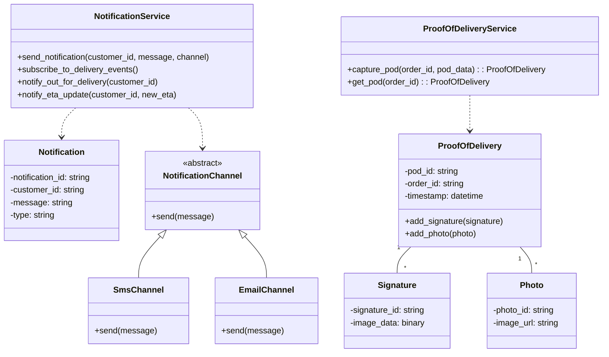

```mermaid
classDiagram
    class NotificationService {
        +send_notification(customer_id, message, channel)
        +subscribe_to_delivery_events()
        +notify_out_for_delivery(customer_id)
        +notify_eta_update(customer_id, new_eta)
    }
    class Notification {
        -notification_id: string
        -customer_id: string
        -message: string
        -type: string
    }
    class NotificationChannel {
        <<abstract>>
        +send(message)
    }
    class SmsChannel {
        +send(message)
    }
    class EmailChannel {
        +send(message)
    }
    class ProofOfDeliveryService {
        +capture_pod(order_id, pod_data): ProofOfDelivery
        +get_pod(order_id): ProofOfDelivery
    }
    class ProofOfDelivery {
        -pod_id: string
        -order_id: string
        -timestamp: datetime
        +add_signature(signature)
        +add_photo(photo)
    }
    class Signature {
        -signature_id: string
        -image_data: binary
    }
    class Photo {
        -photo_id: string
        -image_url: string
    }
    NotificationService ..> Notification
    NotificationService ..> NotificationChannel
    NotificationChannel <|-- SmsChannel
    NotificationChannel <|-- EmailChannel
    ProofOfDeliveryService ..> ProofOfDelivery
    ProofOfDelivery "1" -- "*" Signature
    ProofOfDelivery "1" -- "*" Photo
```