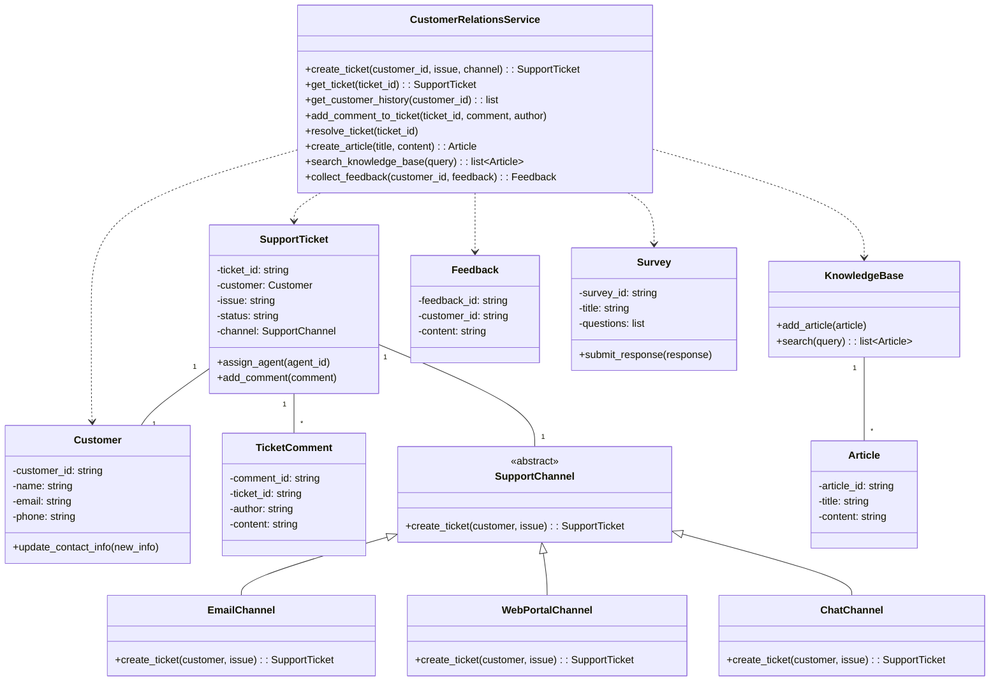

```mermaid
classDiagram
    class CustomerRelationsService {
        +create_ticket(customer_id, issue, channel): SupportTicket
        +get_ticket(ticket_id): SupportTicket
        +get_customer_history(customer_id): list
        +add_comment_to_ticket(ticket_id, comment, author)
        +resolve_ticket(ticket_id)
        +create_article(title, content): Article
        +search_knowledge_base(query): list~Article~
        +collect_feedback(customer_id, feedback): Feedback
    }
    class Customer {
        -customer_id: string
        -name: string
        -email: string
        -phone: string
        +update_contact_info(new_info)
    }
    class SupportTicket {
        -ticket_id: string
        -customer: Customer
        -issue: string
        -status: string
        -channel: SupportChannel
        +assign_agent(agent_id)
        +add_comment(comment)
    }
    class TicketComment {
        -comment_id: string
        -ticket_id: string
        -author: string
        -content: string
    }
    class SupportChannel {
        <<abstract>>
        +create_ticket(customer, issue): SupportTicket
    }
    class EmailChannel {
        +create_ticket(customer, issue): SupportTicket
    }
    class WebPortalChannel {
        +create_ticket(customer, issue): SupportTicket
    }
    class ChatChannel {
        +create_ticket(customer, issue): SupportTicket
    }
    class KnowledgeBase {
        +add_article(article)
        +search(query): list~Article~
    }
    class Article {
        -article_id: string
        -title: string
        -content: string
    }
    class Feedback {
        -feedback_id: string
        -customer_id: string
        -content: string
    }
    class Survey {
        -survey_id: string
        -title: string
        -questions: list
        +submit_response(response)
    }
    CustomerRelationsService ..> Customer
    CustomerRelationsService ..> SupportTicket
    CustomerRelationsService ..> KnowledgeBase
    CustomerRelationsService ..> Feedback
    CustomerRelationsService ..> Survey
    SupportTicket "1" -- "1" Customer
    SupportTicket "1" -- "*" TicketComment
    SupportTicket "1" -- "1" SupportChannel
    SupportChannel <|-- EmailChannel
    SupportChannel <|-- WebPortalChannel
    SupportChannel <|-- ChatChannel
    KnowledgeBase "1" -- "*" Article
```