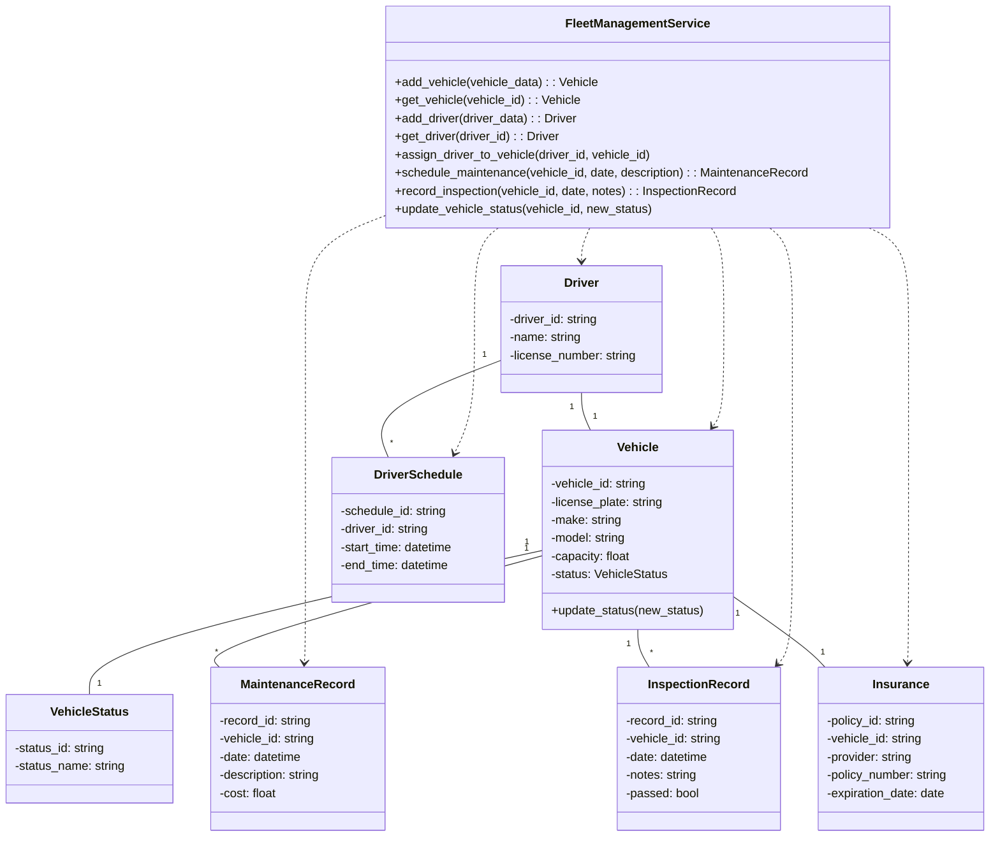

```mermaid
classDiagram
    class FleetManagementService {
        +add_vehicle(vehicle_data): Vehicle
        +get_vehicle(vehicle_id): Vehicle
        +add_driver(driver_data): Driver
        +get_driver(driver_id): Driver
        +assign_driver_to_vehicle(driver_id, vehicle_id)
        +schedule_maintenance(vehicle_id, date, description): MaintenanceRecord
        +record_inspection(vehicle_id, date, notes): InspectionRecord
        +update_vehicle_status(vehicle_id, new_status)
    }
    class Vehicle {
        -vehicle_id: string
        -license_plate: string
        -make: string
        -model: string
        -capacity: float
        -status: VehicleStatus
        +update_status(new_status)
    }
    class Driver {
        -driver_id: string
        -name: string
        -license_number: string
    }
    class MaintenanceRecord {
        -record_id: string
        -vehicle_id: string
        -date: datetime
        -description: string
        -cost: float
    }
    class InspectionRecord {
        -record_id: string
        -vehicle_id: string
        -date: datetime
        -notes: string
        -passed: bool
    }
    class Insurance {
        -policy_id: string
        -vehicle_id: string
        -provider: string
        -policy_number: string
        -expiration_date: date
    }
    class VehicleStatus {
        -status_id: string
        -status_name: string
    }
    class DriverSchedule {
        -schedule_id: string
        -driver_id: string
        -start_time: datetime
        -end_time: datetime
    }
    FleetManagementService ..> Vehicle
    FleetManagementService ..> Driver
    FleetManagementService ..> MaintenanceRecord
    FleetManagementService ..> InspectionRecord
    FleetManagementService ..> Insurance
    FleetManagementService ..> DriverSchedule
    Vehicle "1" -- "1" VehicleStatus
    Vehicle "1" -- "*" MaintenanceRecord
    Vehicle "1" -- "*" InspectionRecord
    Vehicle "1" -- "1" Insurance
    Driver "1" -- "*" DriverSchedule
    Driver "1" -- "1" Vehicle
```