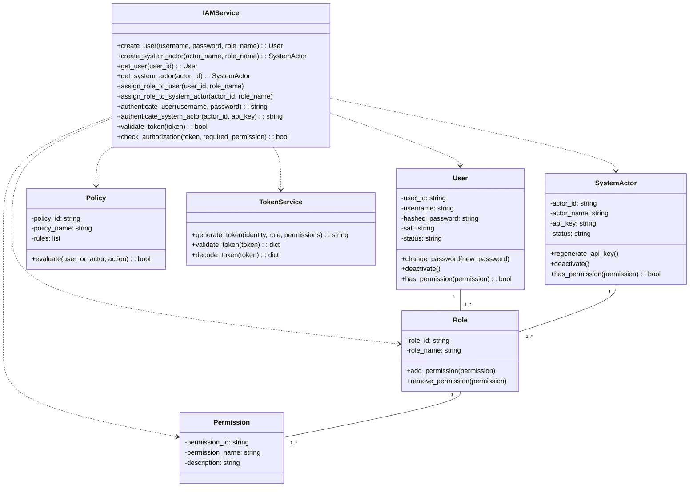

```mermaid
classDiagram
    class IAMService {
        +create_user(username, password, role_name): User
        +create_system_actor(actor_name, role_name): SystemActor
        +get_user(user_id): User
        +get_system_actor(actor_id): SystemActor
        +assign_role_to_user(user_id, role_name)
        +assign_role_to_system_actor(actor_id, role_name)
        +authenticate_user(username, password): string
        +authenticate_system_actor(actor_id, api_key): string
        +validate_token(token): bool
        +check_authorization(token, required_permission): bool
    }
    class User {
        -user_id: string
        -username: string
        -hashed_password: string
        -salt: string
        -status: string
        +change_password(new_password)
        +deactivate()
        +has_permission(permission): bool
    }
    class SystemActor {
        -actor_id: string
        -actor_name: string
        -api_key: string
        -status: string
        +regenerate_api_key()
        +deactivate()
        +has_permission(permission): bool
    }
    class Role {
        -role_id: string
        -role_name: string
        +add_permission(permission)
        +remove_permission(permission)
    }
    class Permission {
        -permission_id: string
        -permission_name: string
        -description: string
    }
    class Policy {
        -policy_id: string
        -policy_name: string
        -rules: list
        +evaluate(user_or_actor, action): bool
    }
    class TokenService {
        +generate_token(identity, role, permissions): string
        +validate_token(token): dict
        +decode_token(token): dict
    }
    IAMService ..> User
    IAMService ..> SystemActor
    IAMService ..> Role
    IAMService ..> Permission
    IAMService ..> Policy
    IAMService ..> TokenService
    User "1" -- "1..*" Role
    SystemActor "1" -- "1..*" Role
    Role "1" -- "1..*" Permission
```