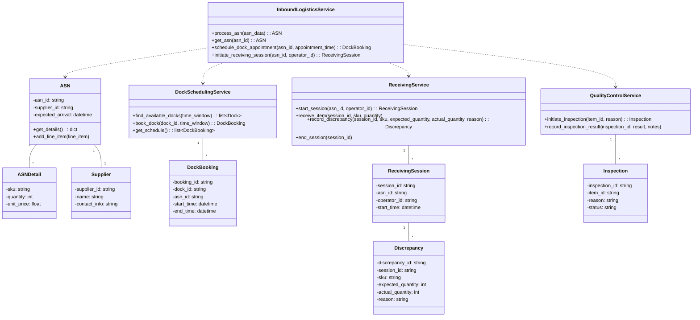

```mermaid
classDiagram
    class InboundLogisticsService {
        +process_asn(asn_data): ASN
        +get_asn(asn_id): ASN
        +schedule_dock_appointment(asn_id, appointment_time): DockBooking
        +initiate_receiving_session(asn_id, operator_id): ReceivingSession
    }
    class ASN {
        -asn_id: string
        -supplier_id: string
        -expected_arrival: datetime
        +get_details(): dict
        +add_line_item(line_item)
    }
    class ASNDetail {
        -sku: string
        -quantity: int
        -unit_price: float
    }
    class Supplier {
        -supplier_id: string
        -name: string
        -contact_info: string
    }
    class DockSchedulingService {
        +find_available_docks(time_window): list~Dock~
        +book_dock(dock_id, time_window): DockBooking
        +get_schedule(): list~DockBooking~
    }
    class DockBooking {
        -booking_id: string
        -dock_id: string
        -asn_id: string
        -start_time: datetime
        -end_time: datetime
    }
    class ReceivingService {
        +start_session(asn_id, operator_id): ReceivingSession
        +receive_item(session_id, sku, quantity)
        +record_discrepancy(session_id, sku, expected_quantity, actual_quantity, reason): Discrepancy
        +end_session(session_id)
    }
    class ReceivingSession {
        -session_id: string
        -asn_id: string
        -operator_id: string
        -start_time: datetime
    }
    class Discrepancy {
        -discrepancy_id: string
        -session_id: string
        -sku: string
        -expected_quantity: int
        -actual_quantity: int
        -reason: string
    }
    class QualityControlService {
        +initiate_inspection(item_id, reason): Inspection
        +record_inspection_result(inspection_id, result, notes)
    }
    class Inspection {
        -inspection_id: string
        -item_id: string
        -reason: string
        -status: string
    }
    InboundLogisticsService ..> ASN
    InboundLogisticsService ..> DockSchedulingService
    InboundLogisticsService ..> ReceivingService
    InboundLogisticsService ..> QualityControlService
    ASN "1" -- "*" ASNDetail
    ASN "1" -- "1" Supplier
    DockSchedulingService "1" -- "*" DockBooking
    ReceivingService "1" -- "*" ReceivingSession
    ReceivingSession "1" -- "*" Discrepancy
    QualityControlService "1" -- "*" Inspection
```