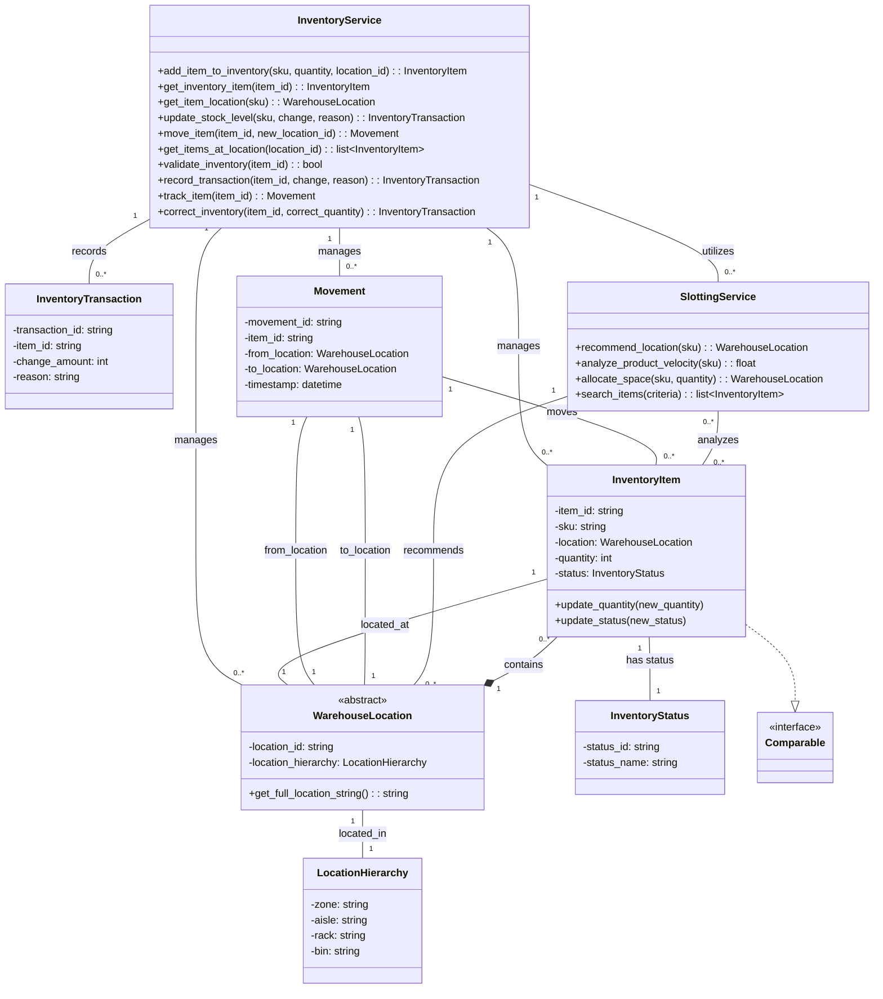

```mermaid
classDiagram
  class InventoryService {
      +add_item_to_inventory(sku, quantity, location_id): InventoryItem
      +get_inventory_item(item_id): InventoryItem
      +get_item_location(sku): WarehouseLocation
      +update_stock_level(sku, change, reason): InventoryTransaction
      +move_item(item_id, new_location_id): Movement
      +get_items_at_location(location_id): list~InventoryItem~
      +validate_inventory(item_id): bool
      +record_transaction(item_id, change, reason): InventoryTransaction
      +track_item(item_id): Movement
      +correct_inventory(item_id, correct_quantity): InventoryTransaction
  }


  class InventoryItem {
      -item_id: string
      -sku: string
      -location: WarehouseLocation
      -quantity: int
      -status: InventoryStatus
      +update_quantity(new_quantity)
      +update_status(new_status)
  }


  class WarehouseLocation {
      -location_id: string
      -location_hierarchy: LocationHierarchy
      +get_full_location_string(): string
  }
  <<abstract>> WarehouseLocation


  class LocationHierarchy {
      -zone: string
      -aisle: string
      -rack: string
      -bin: string
  }


  class InventoryTransaction {
      -transaction_id: string
      -item_id: string
      -change_amount: int
      -reason: string
  }


  class SlottingService {
      +recommend_location(sku): WarehouseLocation
      +analyze_product_velocity(sku): float
      +allocate_space(sku, quantity): WarehouseLocation
      +search_items(criteria): list~InventoryItem~
  }


  class Movement {
      -movement_id: string
      -item_id: string
      -from_location: WarehouseLocation
      -to_location: WarehouseLocation
      -timestamp: datetime
  }


  class InventoryStatus {
      -status_id: string
      -status_name: string
  }


  class Comparable {
  }
  <<interface>> Comparable


  InventoryService "1" -- "0..*" InventoryItem: manages
  InventoryService "1" -- "0..*" InventoryTransaction: records
  InventoryService "1" -- "0..*" Movement: manages
  InventoryService "1" -- "0..*" SlottingService: utilizes
  InventoryService "1" -- "0..*" WarehouseLocation: manages
  InventoryItem "1" -- "1" WarehouseLocation: located_at
  InventoryItem "1" -- "1" InventoryStatus: has status
  WarehouseLocation "1" *-- "0..*" InventoryItem: contains
  WarehouseLocation "1" -- "1" LocationHierarchy: located_in
  Movement "1" -- "1" WarehouseLocation: from_location
  Movement "1" -- "1" WarehouseLocation: to_location
  Movement "1" -- "0..*" InventoryItem: moves
  SlottingService "1" -- "0..*" WarehouseLocation: recommends
  SlottingService "0..*" -- "0..*" InventoryItem: analyzes


  InventoryItem ..|> Comparable
```
