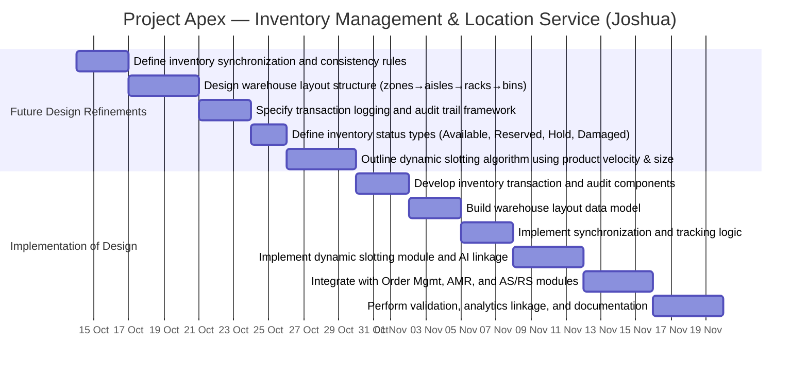

```mermaid
gantt
    title Project Apex — Inventory Management & Location Service (Joshua)
    dateFormat  YYYY-MM-DD
    axisFormat  %d %b
    todayMarker off


    section Future Design Refinements
    Define inventory synchronization and consistency rules          :ref1, 2025-10-14, 3d
    Design warehouse layout structure (zones→aisles→racks→bins)     :ref2, after ref1, 4d
    Specify transaction logging and audit trail framework           :ref3, after ref2, 3d
    Define inventory status types (Available, Reserved, Hold, Damaged) :ref4, after ref3, 2d
    Outline dynamic slotting algorithm using product velocity & size :ref5, after ref4, 4d


    section Implementation of Design
    Develop inventory transaction and audit components              :imp1, after ref5, 3d
    Build warehouse layout data model                               :imp2, after imp1, 3d
    Implement synchronization and tracking logic                    :imp3, after imp2, 3d
    Implement dynamic slotting module and AI linkage                :imp4, after imp3, 4d
    Integrate with Order Mgmt, AMR, and AS/RS modules               :imp5, after imp4, 4d
    Perform validation, analytics linkage, and documentation        :imp6, after imp5, 4d
```
