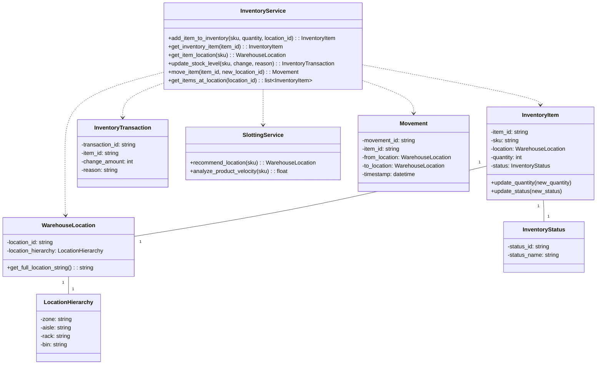

```mermaid
classDiagram
    class InventoryService {
        +add_item_to_inventory(sku, quantity, location_id): InventoryItem
        +get_inventory_item(item_id): InventoryItem
        +get_item_location(sku): WarehouseLocation
        +update_stock_level(sku, change, reason): InventoryTransaction
        +move_item(item_id, new_location_id): Movement
        +get_items_at_location(location_id): list~InventoryItem~
    }
    class InventoryItem {
        -item_id: string
        -sku: string
        -location: WarehouseLocation
        -quantity: int
        -status: InventoryStatus
        +update_quantity(new_quantity)
        +update_status(new_status)
    }
    class WarehouseLocation {
        -location_id: string
        -location_hierarchy: LocationHierarchy
        +get_full_location_string(): string
    }
    class LocationHierarchy {
        -zone: string
        -aisle: string
        -rack: string
        -bin: string
    }
    class InventoryTransaction {
        -transaction_id: string
        -item_id: string
        -change_amount: int
        -reason: string
    }
    class SlottingService {
        +recommend_location(sku): WarehouseLocation
        +analyze_product_velocity(sku): float
    }
    class Movement {
        -movement_id: string
        -item_id: string
        -from_location: WarehouseLocation
        -to_location: WarehouseLocation
        -timestamp: datetime
    }
    class InventoryStatus {
        -status_id: string
        -status_name: string
    }
    InventoryService ..> InventoryItem
    InventoryService ..> WarehouseLocation
    InventoryService ..> InventoryTransaction
    InventoryService ..> SlottingService
    InventoryService ..> Movement
    InventoryItem "1" -- "1" WarehouseLocation
    InventoryItem "1" -- "1" InventoryStatus
    WarehouseLocation "1" -- "1" LocationHierarchy
```