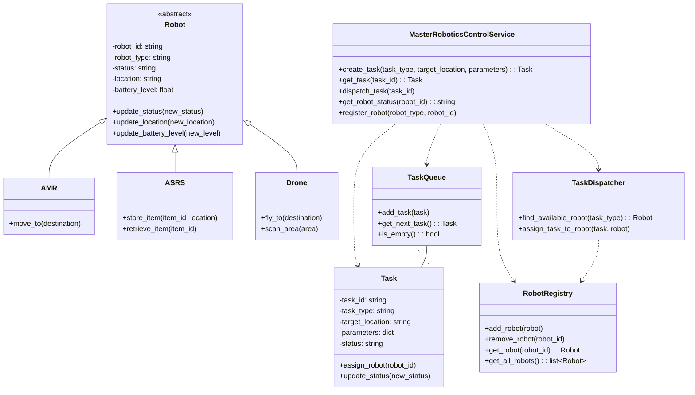

```mermaid
classDiagram
    class MasterRoboticsControlService {
        +create_task(task_type, target_location, parameters): Task
        +get_task(task_id): Task
        +dispatch_task(task_id)
        +get_robot_status(robot_id): string
        +register_robot(robot_type, robot_id)
    }
    class Robot {
        <<abstract>>
        -robot_id: string
        -robot_type: string
        -status: string
        -location: string
        -battery_level: float
        +update_status(new_status)
        +update_location(new_location)
        +update_battery_level(new_level)
    }
    class AMR {
        +move_to(destination)
    }
    class ASRS {
        +store_item(item_id, location)
        +retrieve_item(item_id)
    }
    class Drone {
        +fly_to(destination)
        +scan_area(area)
    }
    class Task {
        -task_id: string
        -task_type: string
        -target_location: string
        -parameters: dict
        -status: string
        +assign_robot(robot_id)
        +update_status(new_status)
    }
    class TaskQueue {
        +add_task(task)
        +get_next_task(): Task
        +is_empty(): bool
    }
    class TaskDispatcher {
        +find_available_robot(task_type): Robot
        +assign_task_to_robot(task, robot)
    }
    class RobotRegistry {
        +add_robot(robot)
        +remove_robot(robot_id)
        +get_robot(robot_id): Robot
        +get_all_robots(): list~Robot~
    }
    MasterRoboticsControlService ..> Task
    MasterRoboticsControlService ..> TaskQueue
    MasterRoboticsControlService ..> TaskDispatcher
    MasterRoboticsControlService ..> RobotRegistry
    Robot <|-- AMR
    Robot <|-- ASRS
    Robot <|-- Drone
    TaskDispatcher ..> RobotRegistry
    TaskQueue "1" -- "*" Task
```