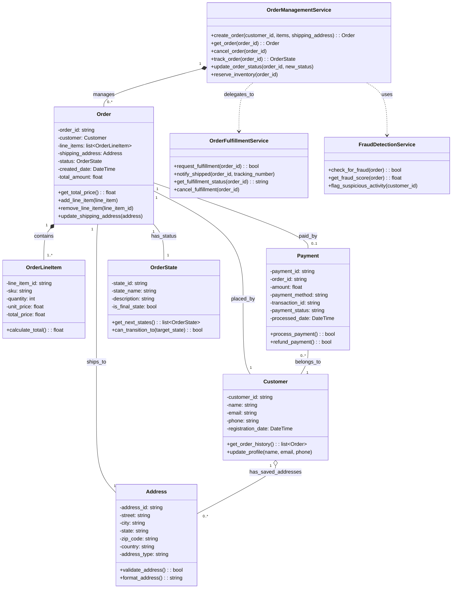

```mermaid
classDiagram
    class OrderManagementService {
        +create_order(customer_id, items, shipping_address): Order
        +get_order(order_id): Order
        +cancel_order(order_id)
        +track_order(order_id): OrderState
        +update_order_status(order_id, new_status)
        +reserve_inventory(order_id)
    }
    
    class Order {
        -order_id: string
        -customer: Customer
        -line_items: list~OrderLineItem~
        -shipping_address: Address
        -status: OrderState
        -created_date: DateTime
        -total_amount: float
        +get_total_price(): float
        +add_line_item(line_item)
        +remove_line_item(line_item_id)
        +update_shipping_address(address)
    }
    
    class OrderLineItem {
        -line_item_id: string
        -sku: string
        -quantity: int
        -unit_price: float
        -total_price: float
        +calculate_total(): float
    }
    
    class Customer {
        -customer_id: string
        -name: string
        -email: string
        -phone: string
        -registration_date: DateTime
        +get_order_history(): list~Order~
        +update_profile(name, email, phone)
    }
    
    class Address {
        -address_id: string
        -street: string
        -city: string
        -state: string
        -zip_code: string
        -country: string
        -address_type: string
        +validate_address(): bool
        +format_address(): string
    }
    
    class Payment {
        -payment_id: string
        -order_id: string
        -amount: float
        -payment_method: string
        -transaction_id: string
        -payment_status: string
        -processed_date: DateTime
        +process_payment(): bool
        +refund_payment(): bool
    }
    
    class OrderState {
        -state_id: string
        -state_name: string
        -description: string
        -is_final_state: bool
        +get_next_states(): list~OrderState~
        +can_transition_to(target_state): bool
    }
    
    class OrderFulfillmentService {
        +request_fulfillment(order_id): bool
        +notify_shipped(order_id, tracking_number)
        +get_fulfillment_status(order_id): string
        +cancel_fulfillment(order_id)
    }
    
    class FraudDetectionService {
        +check_for_fraud(order): bool
        +get_fraud_score(order): float
        +flag_suspicious_activity(customer_id)
    }

    %% Core Associations with Multiplicity
    OrderManagementService "1" *-- "0..*" Order : manages
    Order "1" -- "1" Customer : placed_by
    Order "1" *-- "1..*" OrderLineItem : contains
    Order "1" -- "1" Address : ships_to
    Order "1" -- "1" OrderState : has_status
    Order "1" -- "0..1" Payment : paid_by
    
    %% Service Dependencies (Uni-directional)
    OrderManagementService ..> FraudDetectionService : uses
    OrderManagementService ..> OrderFulfillmentService : delegates_to
    
    %% Customer-Address Relationship (Customer can have multiple addresses)
    Customer "1" o-- "0..*" Address : has_saved_addresses
    
    %% Payment-Customer Association
    Payment "0..*" -- "1" Customer : belongs_to
```
