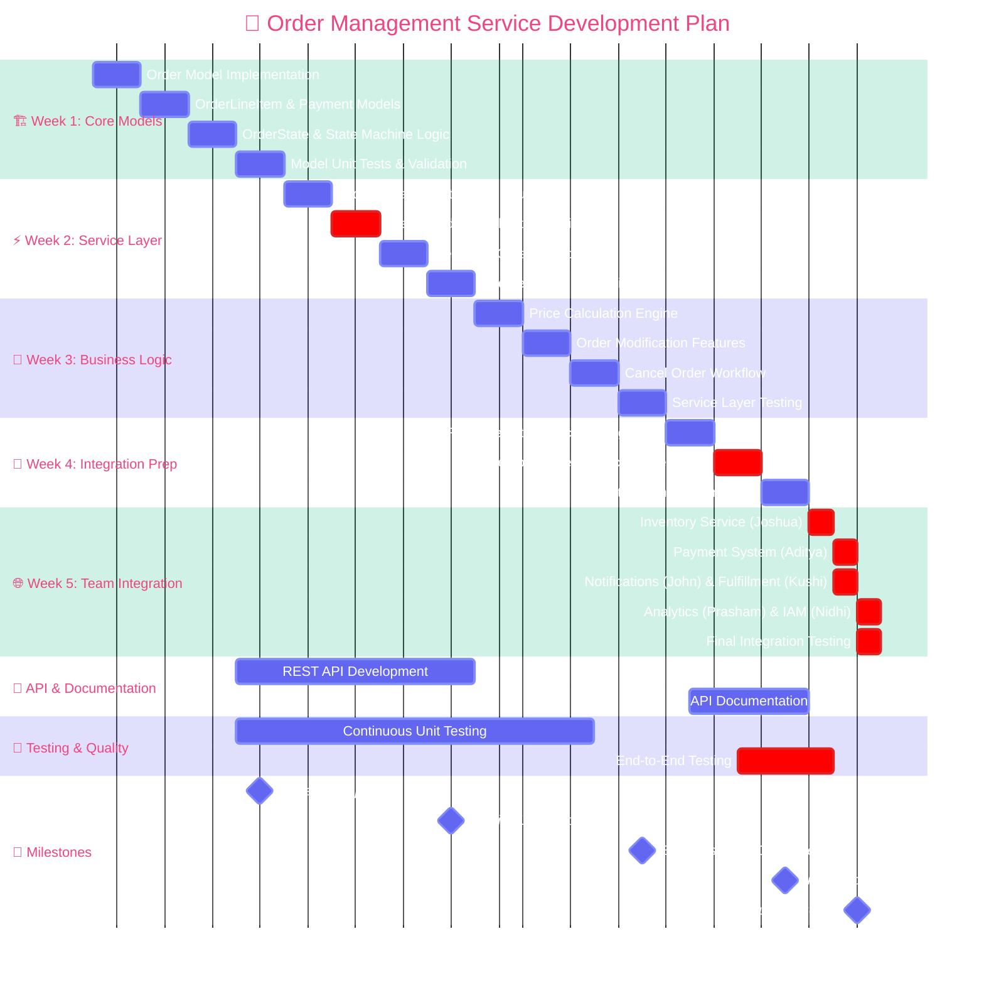

# 📊 Order Management Service - Development Gantt Chart
**Developer:** Omkar Shrikanth
**Timeline:** October 14 - November 15, 2025 (33 days)
**Project:** Project Apex - Order Management Service Module
---
## 🎯 Development Roadmap

---
