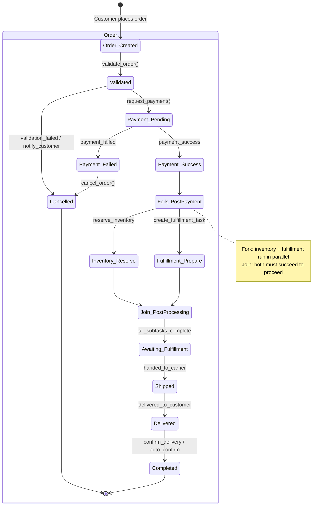
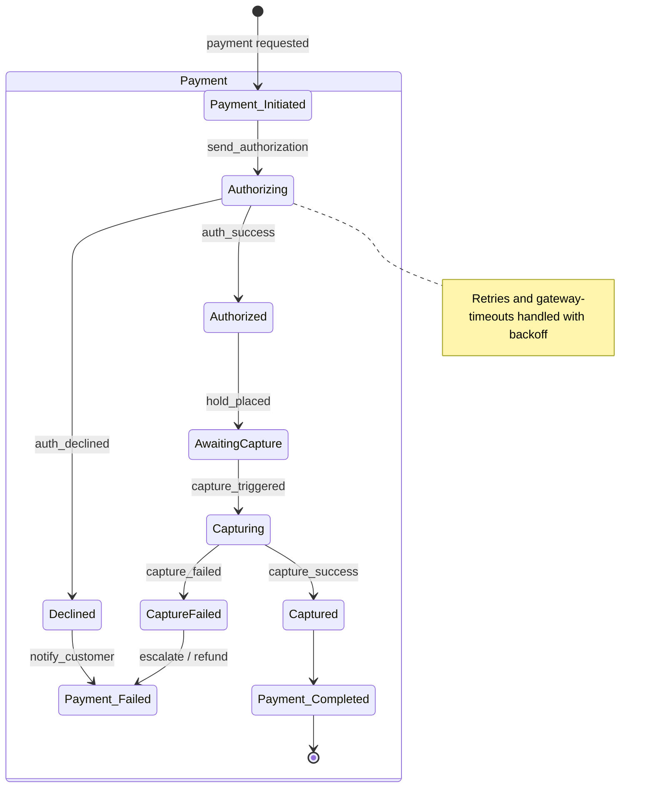
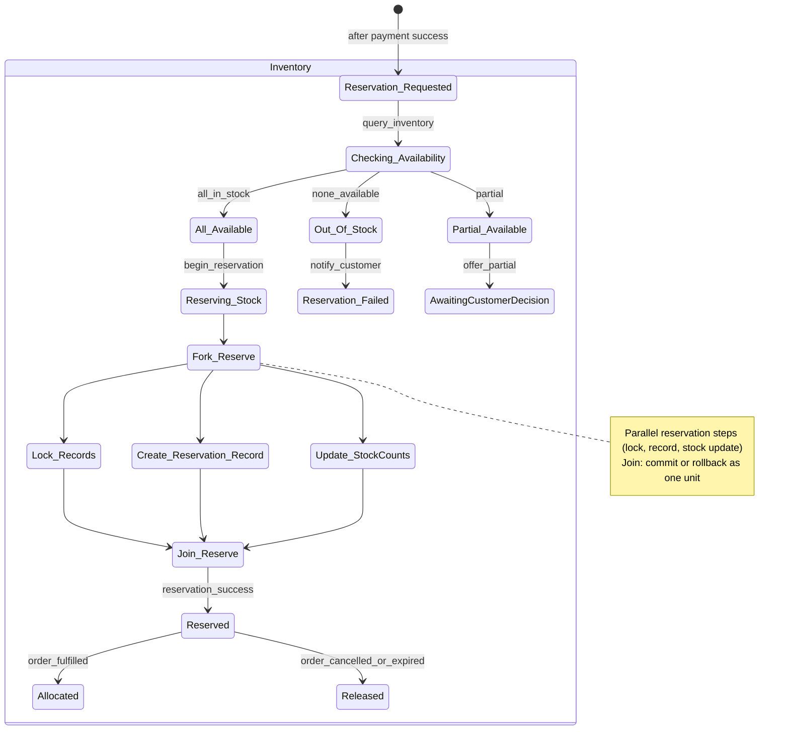
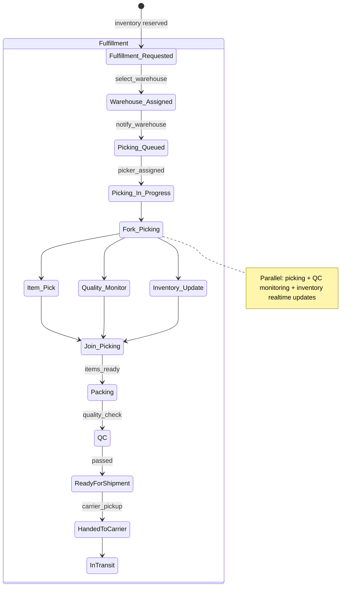
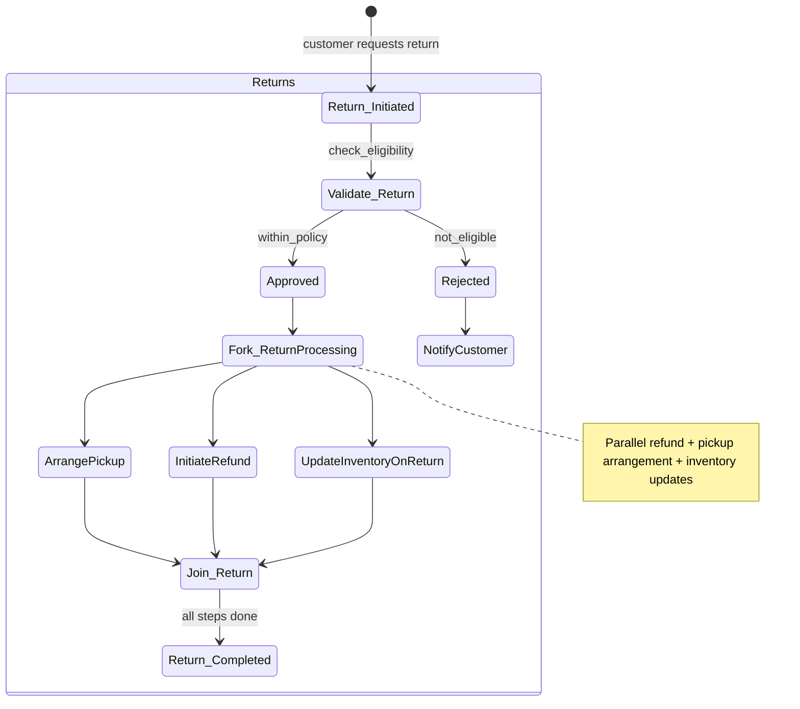

# Order Management Service — State Charts
---
## 1. Order Lifecycle

---
## 2. Payment Processing

---
## 3. Inventory Reservation

---
## 4. Order Fulfillment

---
## 5. Returns & Cancellation

