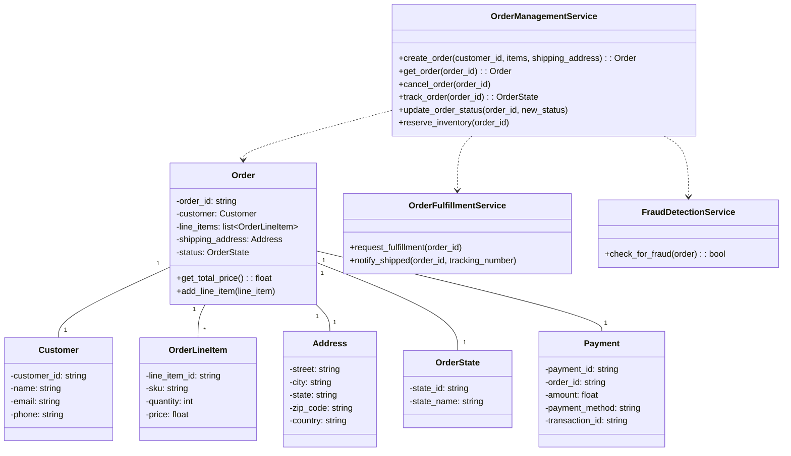

```mermaid
classDiagram
    class OrderManagementService {
        +create_order(customer_id, items, shipping_address): Order
        +get_order(order_id): Order
        +cancel_order(order_id)
        +track_order(order_id): OrderState
        +update_order_status(order_id, new_status)
        +reserve_inventory(order_id)
    }
    class Order {
        -order_id: string
        -customer: Customer
        -line_items: list~OrderLineItem~
        -shipping_address: Address
        -status: OrderState
        +get_total_price(): float
        +add_line_item(line_item)
    }
    class OrderLineItem {
        -line_item_id: string
        -sku: string
        -quantity: int
        -price: float
    }
    class Customer {
        -customer_id: string
        -name: string
        -email: string
        -phone: string
    }
    class Address {
        -street: string
        -city: string
        -state: string
        -zip_code: string
        -country: string
    }
    class Payment {
        -payment_id: string
        -order_id: string
        -amount: float
        -payment_method: string
        -transaction_id: string
    }
    class OrderState {
        -state_id: string
        -state_name: string
    }
    class OrderFulfillmentService {
        +request_fulfillment(order_id)
        +notify_shipped(order_id, tracking_number)
    }
    class FraudDetectionService {
        +check_for_fraud(order): bool
    }
    OrderManagementService ..> Order
    OrderManagementService ..> OrderFulfillmentService
    OrderManagementService ..> FraudDetectionService
    Order "1" -- "1" Customer
    Order "1" -- "*" OrderLineItem
    Order "1" -- "1" Address
    Order "1" -- "1" OrderState
    Order "1" -- "1" Payment
```