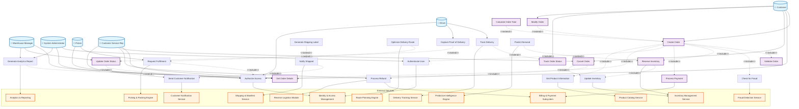

```mermaid
graph TD
    %% Actors
    Customer[("👤 Customer")]
    WarehouseManager[("👤 Warehouse Manager")]
    SystemAdmin[("👤 System Administrator")]
    Picker[("👤 Picker")]
    Driver[("👤 Driver")]
    CustomerService[("👤 Customer Service Rep")]
    
    %% Order Management Service Use Cases
    CreateOrder["Create Order"]
    GetOrder["Get Order Details"]
    CancelOrder["Cancel Order"]
    TrackOrder["Track Order Status"]
    UpdateOrderStatus["Update Order Status"]
    ReserveInventory["Reserve Inventory"]
    ValidateOrder["Validate Order"]
    ProcessPayment["Process Payment"]
    CalculateTotal["Calculate Order Total"]
    ModifyOrder["Modify Order"]
    
    %% External Service Connections
    CheckFraud["Check for Fraud"]
    RequestFulfillment["Request Fulfillment"]
    NotifyShipped["Notify Shipped"]
    UpdateInventory["Update Inventory"]
    GenerateShippingLabel["Generate Shipping Label"]
    SendNotification["Send Customer Notification"]
    ProcessRefund["Process Refund"]
    AuthenticateUser["Authenticate User"]
    AuthorizeAccess["Authorize Access"]
    GetProductInfo["Get Product Information"]
    OptimizeRoute["Optimize Delivery Route"]
    TrackDelivery["Track Delivery"]
    CapturePOD["Capture Proof of Delivery"]
    GenerateReport["Generate Analytics Report"]
    PredictDemand["Predict Demand"]
    
    %% Include Relationships
    CreateOrder -.->|"&lt;&lt;include&gt;&gt;"| ValidateOrder
    CreateOrder -.->|"&lt;&lt;include&gt;&gt;"| CheckFraud
    CreateOrder -.->|"&lt;&lt;include&gt;&gt;"| ReserveInventory
    CreateOrder -.->|"&lt;&lt;include&gt;&gt;"| ProcessPayment
    CreateOrder -.->|"&lt;&lt;include&gt;&gt;"| AuthenticateUser
    CreateOrder -.->|"&lt;&lt;include&gt;&gt;"| AuthorizeAccess
    CreateOrder -.->|"&lt;&lt;include&gt;&gt;"| GetProductInfo
    
    UpdateOrderStatus -.->|"&lt;&lt;include&gt;&gt;"| AuthorizeAccess
    ReserveInventory -.->|"&lt;&lt;include&gt;&gt;"| UpdateInventory
    RequestFulfillment -.->|"&lt;&lt;include&gt;&gt;"| AuthorizeAccess
    NotifyShipped -.->|"&lt;&lt;include&gt;&gt;"| SendNotification
    CancelOrder -.->|"&lt;&lt;include&gt;&gt;"| ProcessRefund
    CancelOrder -.->|"&lt;&lt;include&gt;&gt;"| UpdateInventory
    
    %% Extend Relationships
    ModifyOrder -.->|"&lt;&lt;extend&gt;&gt;"| CreateOrder
    CalculateTotal -.->|"&lt;&lt;extend&gt;&gt;"| CreateOrder
    TrackDelivery -.->|"&lt;&lt;extend&gt;&gt;"| TrackOrder
    CapturePOD -.->|"&lt;&lt;extend&gt;&gt;"| UpdateOrderStatus
    OptimizeRoute -.->|"&lt;&lt;extend&gt;&gt;"| RequestFulfillment
    GenerateShippingLabel -.->|"&lt;&lt;extend&gt;&gt;"| NotifyShipped
    GenerateReport -.->|"&lt;&lt;extend&gt;&gt;"| GetOrder
    PredictDemand -.->|"&lt;&lt;extend&gt;&gt;"| ReserveInventory
    
    %% Actor Connections to Use Cases
    Customer --> CreateOrder
    Customer --> GetOrder
    Customer --> CancelOrder
    Customer --> TrackOrder
    Customer --> ModifyOrder
    
    WarehouseManager --> GetOrder
    WarehouseManager --> UpdateOrderStatus
    WarehouseManager --> GenerateReport
    
    SystemAdmin --> AuthenticateUser
    SystemAdmin --> AuthorizeAccess
    SystemAdmin --> GenerateReport
    
    Picker --> RequestFulfillment
    Picker --> AuthorizeAccess
    
    Driver --> TrackDelivery
    Driver --> CapturePOD
    Driver --> AuthorizeAccess
    
    CustomerService --> GetOrder
    CustomerService --> CancelOrder
    CustomerService --> ProcessRefund
    CustomerService --> SendNotification
    
    %% External Service Connections (shown as system boundaries)
    subgraph "External Services"
        FraudDetectionService["Fraud Detection Service"]
        InventoryService["Inventory Management Service"]
        FulfillmentService["Picking & Packing Engine"]
        ShippingService["Shipping & Manifest Service"]
        NotificationService["Customer Notification Service"]
        PaymentService["Billing & Payment Subsystem"]
        IAMService["Identity & Access Management"]
        ProductCatalogService["Product Catalog Service"]
        RoutePlanningService["Route Planning Engine"]
        DeliveryTrackingService["Delivery Tracking Service"]
        AnalyticsService["Analytics & Reporting"]
        PredictiveService["Predictive Intelligence Engine"]
        ReturnsService["Reverse Logistics Module"]
    end
    
    %% Connections to External Services
    CheckFraud --> FraudDetectionService
    ReserveInventory --> InventoryService
    UpdateInventory --> InventoryService
    RequestFulfillment --> FulfillmentService
    NotifyShipped --> ShippingService
    SendNotification --> NotificationService
    ProcessPayment --> PaymentService
    ProcessRefund --> PaymentService
    AuthenticateUser --> IAMService
    AuthorizeAccess --> IAMService
    GetProductInfo --> ProductCatalogService
    OptimizeRoute --> RoutePlanningService
    TrackDelivery --> DeliveryTrackingService
    GenerateReport --> AnalyticsService
    PredictDemand --> PredictiveService
    ProcessRefund --> ReturnsService
    
    %% Styling
    classDef actorClass fill:#e1f5fe,stroke:#01579b,stroke-width:2px
    classDef useCaseClass fill:#f3e5f5,stroke:#4a148c,stroke-width:2px
    classDef externalServiceClass fill:#fff3e0,stroke:#e65100,stroke-width:2px
    classDef includeRel fill:#c8e6c9,stroke:#2e7d32,stroke-width:2px
    classDef extendRel fill:#ffcdd2,stroke:#c62828,stroke-width:2px
    
    class Customer,WarehouseManager,SystemAdmin,Picker,Driver,CustomerService actorClass
    class CreateOrder,GetOrder,CancelOrder,TrackOrder,UpdateOrderStatus,ReserveInventory,ValidateOrder,ProcessPayment,CalculateTotal,ModifyOrder useCaseClass
    class FraudDetectionService,InventoryService,FulfillmentService,ShippingService,NotificationService,PaymentService,IAMService,ProductCatalogService,RoutePlanningService,DeliveryTrackingService,AnalyticsService,PredictiveService,ReturnsService externalServiceClass
```
