# Order Management Service - Use Case Diagram

## Comprehensive Use Case Diagram with All Module Connections

```plantuml
@startuml Order Management Service Use Case Diagram

!define ACTOR_COLOR #e1f5fe
!define USE_CASE_COLOR #f3e5f5
!define EXTERNAL_SERVICE_COLOR #fff3e0
!define INCLUDE_COLOR #c8e6c9
!define EXTEND_COLOR #ffcdd2

skinparam actor {
    BackgroundColor ACTOR_COLOR
    BorderColor #01579b
    BorderThickness 2
}

skinparam usecase {
    BackgroundColor USE_CASE_COLOR
    BorderColor #4a148c
    BorderThickness 2
}

skinparam package {
    BackgroundColor EXTERNAL_SERVICE_COLOR
    BorderColor #e65100
    BorderThickness 2
}

' Actors
:Customer: as Customer
:Warehouse Manager: as WarehouseManager
:System Administrator: as SystemAdmin
:Picker: as Picker
:Driver: as Driver
:Customer Service Rep: as CustomerService

' Core Use Cases
rectangle "Order Management Service" {
    (Create Order) as CreateOrder
    (Get Order Details) as GetOrder
    (Cancel Order) as CancelOrder
    (Track Order Status) as TrackOrder
    (Update Order Status) as UpdateOrderStatus
    (Reserve Inventory) as ReserveInventory
    (Validate Order) as ValidateOrder
    (Process Payment) as ProcessPayment
    (Calculate Order Total) as CalculateTotal
    (Modify Order) as ModifyOrder
}

' External Service Use Cases
(Check for Fraud) as CheckFraud
(Request Fulfillment) as RequestFulfillment
(Notify Shipped) as NotifyShipped
(Update Inventory) as UpdateInventory
(Generate Shipping Label) as GenerateShippingLabel
(Send Customer Notification) as SendNotification
(Process Refund) as ProcessRefund
(Authenticate User) as AuthenticateUser
(Authorize Access) as AuthorizeAccess
(Get Product Information) as GetProductInfo
(Optimize Delivery Route) as OptimizeRoute
(Track Delivery) as TrackDelivery
(Capture Proof of Delivery) as CapturePOD
(Generate Analytics Report) as GenerateReport
(Predict Demand) as PredictDemand

' External Services Package
package "External Services" {
    [Fraud Detection Service] as FraudDetectionService
    [Inventory Management Service] as InventoryService
    [Picking & Packing Engine] as FulfillmentService
    [Shipping & Manifest Service] as ShippingService
    [Customer Notification Service] as NotificationService
    [Billing & Payment Subsystem] as PaymentService
    [Identity & Access Management] as IAMService
    [Product Catalog Service] as ProductCatalogService
    [Route Planning Engine] as RoutePlanningService
    [Delivery Tracking Service] as DeliveryTrackingService
    [Analytics & Reporting] as AnalyticsService
    [Predictive Intelligence Engine] as PredictiveService
    [Reverse Logistics Module] as ReturnsService
}

' Actor to Use Case Relationships
Customer --> CreateOrder
Customer --> GetOrder
Customer --> CancelOrder
Customer --> TrackOrder
Customer --> ModifyOrder

WarehouseManager --> GetOrder
WarehouseManager --> UpdateOrderStatus
WarehouseManager --> GenerateReport

SystemAdmin --> AuthenticateUser
SystemAdmin --> AuthorizeAccess
SystemAdmin --> GenerateReport

Picker --> RequestFulfillment
Picker --> AuthorizeAccess

Driver --> TrackDelivery
Driver --> CapturePOD
Driver --> AuthorizeAccess

CustomerService --> GetOrder
CustomerService --> CancelOrder
CustomerService --> ProcessRefund
CustomerService --> SendNotification

' Include Relationships
CreateOrder .> ValidateOrder : <<include>>
CreateOrder .> CheckFraud : <<include>>
CreateOrder .> ReserveInventory : <<include>>
CreateOrder .> ProcessPayment : <<include>>
CreateOrder .> AuthenticateUser : <<include>>
CreateOrder .> AuthorizeAccess : <<include>>
CreateOrder .> GetProductInfo : <<include>>

UpdateOrderStatus .> AuthorizeAccess : <<include>>
ReserveInventory .> UpdateInventory : <<include>>
RequestFulfillment .> AuthorizeAccess : <<include>>
NotifyShipped .> SendNotification : <<include>>
CancelOrder .> ProcessRefund : <<include>>
CancelOrder .> UpdateInventory : <<include>>

' Extend Relationships
ModifyOrder ..> CreateOrder : <<extend>>
CalculateTotal ..> CreateOrder : <<extend>>
TrackDelivery ..> TrackOrder : <<extend>>
CapturePOD ..> UpdateOrderStatus : <<extend>>
OptimizeRoute ..> RequestFulfillment : <<extend>>
GenerateShippingLabel ..> NotifyShipped : <<extend>>
GenerateReport ..> GetOrder : <<extend>>
PredictDemand ..> ReserveInventory : <<extend>>

' External Service Connections
CheckFraud --> FraudDetectionService
ReserveInventory --> InventoryService
UpdateInventory --> InventoryService
RequestFulfillment --> FulfillmentService
NotifyShipped --> ShippingService
SendNotification --> NotificationService
ProcessPayment --> PaymentService
ProcessRefund --> PaymentService
AuthenticateUser --> IAMService
AuthorizeAccess --> IAMService
GetProductInfo --> ProductCatalogService
OptimizeRoute --> RoutePlanningService
TrackDelivery --> DeliveryTrackingService
GenerateReport --> AnalyticsService
PredictDemand --> PredictiveService
ProcessRefund --> ReturnsService

@enduml
```

## Use Case Diagram Explanation

### Primary Actors
1. **Customer** - End user placing and tracking orders
2. **Warehouse Manager** - Oversees order processing and fulfillment
3. **System Administrator** - Manages system access and security
4. **Picker** - Warehouse worker fulfilling orders
5. **Driver** - Delivery personnel
6. **Customer Service Rep** - Handles customer inquiries and issues

### Core Use Cases
1. **Create Order** - Primary use case for order creation
2. **Get Order Details** - Retrieve order information
3. **Cancel Order** - Cancel existing orders
4. **Track Order Status** - Monitor order progress
5. **Update Order Status** - Change order state
6. **Reserve Inventory** - Allocate stock for orders

### Include Relationships (Required)
- **Validate Order** is included in Create Order
- **Check for Fraud** is included in Create Order
- **Reserve Inventory** is included in Create Order
- **Process Payment** is included in Create Order
- **Authenticate User** is included in Create Order
- **Authorize Access** is included in Create Order
- **Get Product Information** is included in Create Order

### Extend Relationships (Optional)
- **Modify Order** extends Create Order (for order changes)
- **Calculate Total** extends Create Order (for pricing)
- **Track Delivery** extends Track Order (for delivery tracking)
- **Capture Proof of Delivery** extends Update Order Status
- **Optimize Route** extends Request Fulfillment
- **Generate Shipping Label** extends Notify Shipped
- **Generate Report** extends Get Order (for analytics)
- **Predict Demand** extends Reserve Inventory (for forecasting)

### External Service Connections
The Order Management Service connects to all 19 other modules:

1. **Identity & Access Management (Nidhi)** - Authentication and authorization
2. **Product Catalog Service (Shivani)** - Product information
3. **Inventory Management & Location Service (Joshua)** - Stock management
4. **Picking & Packing Orchestration Engine (Kushi)** - Fulfillment
5. **Shipping & Manifest Service (Rahul)** - Shipping operations
6. **Reverse Logistics Module (Aadi)** - Returns processing
7. **Customer Notification & Proof of Delivery Service (John)** - Customer communications
8. **Analytics & Reporting Dashboard (Prasham)** - Business intelligence
9. **Billing and Payment Subsystem (Aditya Vilas)** - Financial transactions
10. **Fleet & Vehicle Management Service (Aadi)** - Delivery fleet
11. **Route Planning & Optimization Engine (Megh)** - Delivery optimization
12. **Real-Time Delivery Tracking & Driver Interface (Swastik)** - Delivery tracking
13. **Customer Relations Module (Sameet)** - Customer support
14. **Master Robotics Control & Task Dispatcher (Purva)** - Automation control
15. **Autonomous Mobile Robot Control System (Saransh)** - AMR operations
16. **Automated Storage/Retrieval Gateway (Arjun)** - AS/RS operations
17. **Aerial Drone Inventory Auditing System (Madhav)** - Inventory auditing
18. **Predictive Intelligence Engine (Tushar)** - AI/ML predictions
19. **Inbound Logistics & Receiving Module (Riddhimman)** - Receiving operations

This comprehensive use case diagram demonstrates how the Order Management Service serves as the central orchestration hub, connecting to every other module in the smart warehouse ecosystem while maintaining clear include and extend relationships for proper use case modeling.