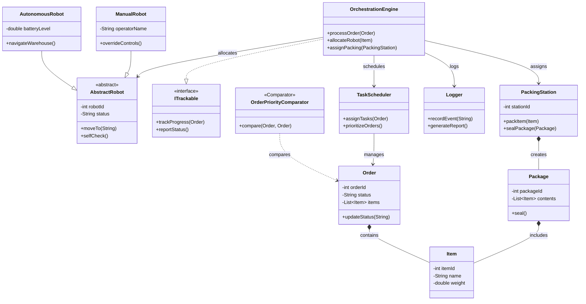

```mermaid
classDiagram
 
   %% Abstract Class
    class AbstractRobot {
      <<abstract>>
      -int robotId
      -String status
      +moveTo(String)
      +selfCheck()
    }
    class AutonomousRobot {
      -double batteryLevel
      +navigateWarehouse()
    }
    class ManualRobot {
      -String operatorName
      +overrideControls()
    }
    %% Interface
    class ITrackable {
      <<interface>>
      +trackProgress(Order)
      +reportStatus()
    }
    %% Comparator
    class OrderPriorityComparator {
      <<Comparator>>
      +compare(Order, Order)
    }
    %% Core Orchestration
    class OrchestrationEngine {
      +processOrder(Order)
      +allocateRobot(Item)
      +assignPacking(PackingStation)
    }
    class TaskScheduler {
      +assignTasks(Order)
      +prioritizeOrders()
    }
    class Logger {
      +recordEvent(String)
      +generateReport()
    }
    %% Orders and Items
    class Order {
      -int orderId
      -String status
      -List~Item~ items
      +updateStatus(String)
    }
    class Item {
      -int itemId
      -String name
      -double weight
    }
    class Package {
      -int packageId
      -List~Item~ contents
      +seal()
    }
    %% Packing
    class PackingStation {
    


  -int stationId
      +packItem(Item)
      +sealPackage(Package)
    }
    %% Generalization
    AutonomousRobot --|> AbstractRobot
    ManualRobot --|> AbstractRobot

    %% Interface implementation
    OrchestrationEngine ..|> ITrackable

    %% Comparator usage
    OrderPriorityComparator ..> Order : compares

    %% Associations
    OrchestrationEngine --> TaskScheduler : schedules
    OrchestrationEngine --> Logger : logs
    OrchestrationEngine --> AbstractRobot : allocates
    OrchestrationEngine --> PackingStation : assigns
    TaskScheduler --> Order : manages
    Order *-- Item : contains
    Package *-- Item : includes
    PackingStation *-- Package : creates

```
