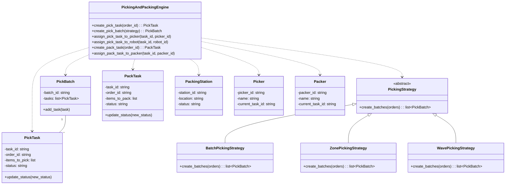

```mermaid
classDiagram
    class PickingAndPackingEngine {
        +create_pick_task(order_id): PickTask
        +create_pick_batch(strategy): PickBatch
        +assign_pick_task_to_picker(task_id, picker_id)
        +assign_pick_task_to_robot(task_id, robot_id)
        +create_pack_task(order_id): PackTask
        +assign_pack_task_to_packer(task_id, packer_id)
    }
    class PickTask {
        -task_id: string
        -order_id: string
        -items_to_pick: list
        -status: string
        +update_status(new_status)
    }
    class PickBatch {
        -batch_id: string
        -tasks: list~PickTask~
        +add_task(task)
    }
    class PickingStrategy {
        <<abstract>>
        +create_batches(orders): list~PickBatch~
    }
    class BatchPickingStrategy {
        +create_batches(orders): list~PickBatch~
    }
    class ZonePickingStrategy {
        +create_batches(orders): list~PickBatch~
    }
    class WavePickingStrategy {
        +create_batches(orders): list~PickBatch~
    }
    class PackTask {
        -task_id: string
        -order_id: string
        -items_to_pack: list
        -status: string
        +update_status(new_status)
    }
    class PackingStation {
        -station_id: string
        -location: string
        -status: string
    }
    class Picker {
        -picker_id: string
        -name: string
        -current_task_id: string
    }
    class Packer {
        -packer_id: string
        -name: string
        -current_task_id: string
    }
    PickingAndPackingEngine ..> PickTask
    PickingAndPackingEngine ..> PickBatch
    PickingAndPackingEngine ..> PickingStrategy
    PickingAndPackingEngine ..> PackTask
    PickingStrategy <|-- BatchPickingStrategy
    PickingStrategy <|-- ZonePickingStrategy
    PickingStrategy <|-- WavePickingStrategy
    PickBatch "1" -- "*" PickTask
    PickingAndPackingEngine ..> Picker
    PickingAndPackingEngine ..> Packer
    PickingAndPackingEngine ..> PackingStation
```