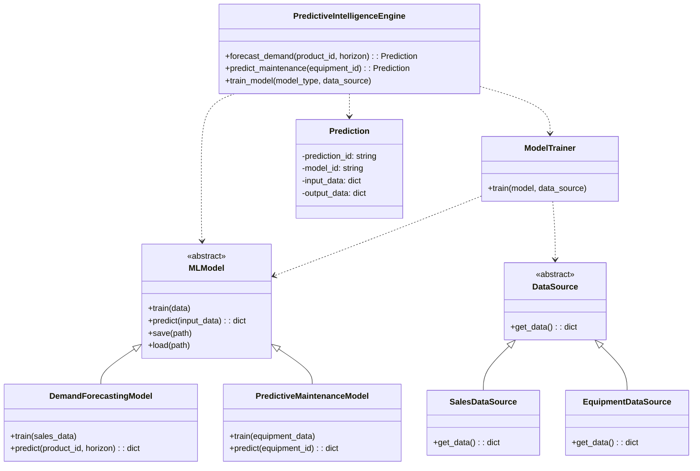

```mermaid
classDiagram
    class PredictiveIntelligenceEngine {
        +forecast_demand(product_id, horizon): Prediction
        +predict_maintenance(equipment_id): Prediction
        +train_model(model_type, data_source)
    }
    class MLModel {
        <<abstract>>
        +train(data)
        +predict(input_data): dict
        +save(path)
        +load(path)
    }
    class DemandForecastingModel {
        +train(sales_data)
        +predict(product_id, horizon): dict
    }
    class PredictiveMaintenanceModel {
        +train(equipment_data)
        +predict(equipment_id): dict
    }
    class ModelTrainer {
        +train(model, data_source)
    }
    class Prediction {
        -prediction_id: string
        -model_id: string
        -input_data: dict
        -output_data: dict
    }
    class DataSource {
        <<abstract>>
        +get_data(): dict
    }
    class SalesDataSource {
        +get_data(): dict
    }
    class EquipmentDataSource {
        +get_data(): dict
    }
    PredictiveIntelligenceEngine ..> MLModel
    PredictiveIntelligenceEngine ..> ModelTrainer
    PredictiveIntelligenceEngine ..> Prediction
    MLModel <|-- DemandForecastingModel
    MLModel <|-- PredictiveMaintenanceModel
    ModelTrainer ..> MLModel
    ModelTrainer ..> DataSource
    DataSource <|-- SalesDataSource
    DataSource <|-- EquipmentDataSource
```