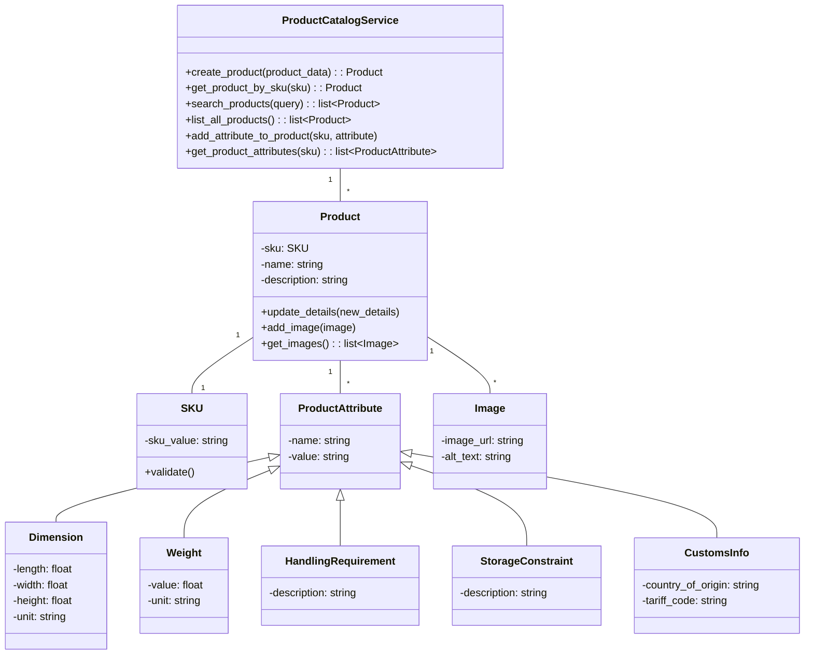

```mermaid
classDiagram
    class ProductCatalogService {
        +create_product(product_data): Product
        +get_product_by_sku(sku): Product
        +search_products(query): list~Product~
        +list_all_products(): list~Product~
        +add_attribute_to_product(sku, attribute)
        +get_product_attributes(sku): list~ProductAttribute~
    }
    class Product {
        -sku: SKU
        -name: string
        -description: string
        +update_details(new_details)
        +add_image(image)
        +get_images(): list~Image~
    }
    class SKU {
        -sku_value: string
        +validate()
    }
    class ProductAttribute {
        -name: string
        -value: string
    }
    class Dimension {
        -length: float
        -width: float
        -height: float
        -unit: string
    }
    class Weight {
        -value: float
        -unit: string
    }
    class HandlingRequirement {
        -description: string
    }
    class StorageConstraint {
        -description: string
    }
    class CustomsInfo {
        -country_of_origin: string
        -tariff_code: string
    }
    class Image {
        -image_url: string
        -alt_text: string
    }
    ProductCatalogService "1" -- "*" Product
    Product "1" -- "1" SKU
    Product "1" -- "*" ProductAttribute
    ProductAttribute <|-- Dimension
    ProductAttribute <|-- Weight
    ProductAttribute <|-- HandlingRequirement
    ProductAttribute <|-- StorageConstraint
    ProductAttribute <|-- CustomsInfo
    Product "1" -- "*" Image
```