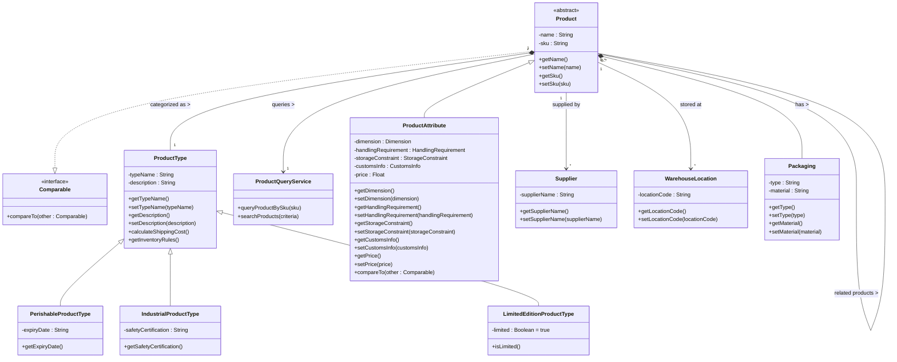

```mermaid
classDiagram
  %% Abstract Product class with Comparable interface
  class Product {
      <<abstract>>
      -name : String
      -sku : String
      +getName()
      +setName(name)
      +getSku()
      +setSku(sku)
  }
  Product ..|> Comparable


  %% Interface Comparable
  class Comparable {
      <<interface>>
      +compareTo(other : Comparable)
  }


  %% ProductType base class representing product categories
  class ProductType {
      -typeName : String
      -description : String
      +getTypeName()
      +setTypeName(typeName)
      +getDescription()
      +setDescription(description)
      +calculateShippingCost()
      +getInventoryRules()
  }


  %% Subclasses of ProductType with specific attributes
  class PerishableProductType {
      -expiryDate : String
      +getExpiryDate()
  }


  class IndustrialProductType {
      -safetyCertification : String
      +getSafetyCertification()
  }


  class LimitedEditionProductType {
      -limited : Boolean = true
      +isLimited()
  }


  %% ProductQueryService for querying products
  class ProductQueryService {
      +queryProductBySku(sku)
      +searchProducts(criteria)
  }


  %% ProductAttribute with cost/price and compareTo implementation
  class ProductAttribute {
      -dimension : Dimension
      -handlingRequirement : HandlingRequirement
      -storageConstraint : StorageConstraint
      -customsInfo : CustomsInfo
      -price : Float
      +getDimension()
      +setDimension(dimension)
      +getHandlingRequirement()
      +setHandlingRequirement(handlingRequirement)
      +getStorageConstraint()
      +setStorageConstraint(storageConstraint)
      +getCustomsInfo()
      +setCustomsInfo(customsInfo)
      +getPrice()
      +setPrice(price)
      +compareTo(other : Comparable)
  }
  Product <|-- ProductAttribute


  %% Supplier and WarehouseLocation classes
  class Supplier {
      -supplierName : String
      +getSupplierName()
      +setSupplierName(supplierName)
  }


  class WarehouseLocation {
      -locationCode : String
      +getLocationCode()
      +setLocationCode(locationCode)
  }


  %% Packaging class composition
  class Packaging {
      -type : String
      -material : String
      +getType()
      +setType(type)
      +getMaterial()
      +setMaterial(material)
  }


  %% Class Relationships and Associations


  Product "1" --> "*" Supplier : supplied by
  Product "1" --> "*" WarehouseLocation : stored at
  Product *-- Packaging : has >
  Product "*" --> "1" ProductQueryService : queries >


  %% ProductType inheritance hierarchy
  ProductType <|-- PerishableProductType
  ProductType <|-- IndustrialProductType
  ProductType <|-- LimitedEditionProductType


  %% Product associates to ProductType (composition)
  Product "1" *-- "1" ProductType : categorized as >


  %% Reflexive association for related products
  Product "0..*" -- "0..*" Product : related products >

```
