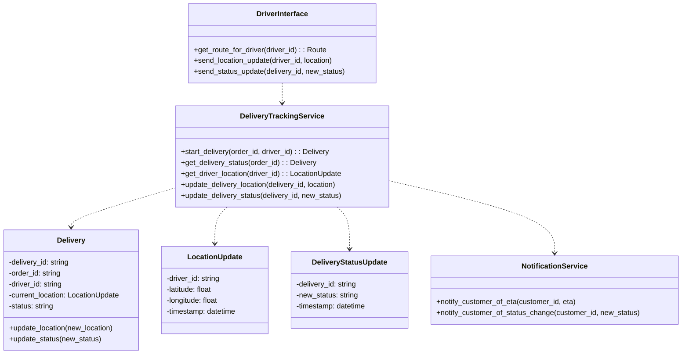

```mermaid
classDiagram
    class DeliveryTrackingService {
        +start_delivery(order_id, driver_id): Delivery
        +get_delivery_status(order_id): Delivery
        +get_driver_location(driver_id): LocationUpdate
        +update_delivery_location(delivery_id, location)
        +update_delivery_status(delivery_id, new_status)
    }
    class DriverInterface {
        +get_route_for_driver(driver_id): Route
        +send_location_update(driver_id, location)
        +send_status_update(delivery_id, new_status)
    }
    class Delivery {
        -delivery_id: string
        -order_id: string
        -driver_id: string
        -current_location: LocationUpdate
        -status: string
        +update_location(new_location)
        +update_status(new_status)
    }
    class LocationUpdate {
        -driver_id: string
        -latitude: float
        -longitude: float
        -timestamp: datetime
    }
    class DeliveryStatusUpdate {
        -delivery_id: string
        -new_status: string
        -timestamp: datetime
    }
    class NotificationService {
        +notify_customer_of_eta(customer_id, eta)
        +notify_customer_of_status_change(customer_id, new_status)
    }
    DeliveryTrackingService ..> Delivery
    DeliveryTrackingService ..> LocationUpdate
    DeliveryTrackingService ..> DeliveryStatusUpdate
    DeliveryTrackingService ..> NotificationService
    DriverInterface ..> DeliveryTrackingService
```