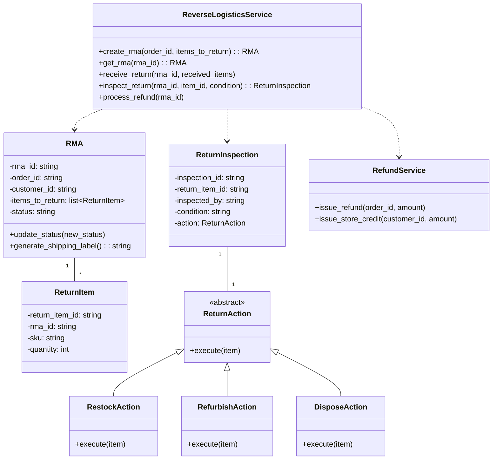

```mermaid
classDiagram
    class ReverseLogisticsService {
        +create_rma(order_id, items_to_return): RMA
        +get_rma(rma_id): RMA
        +receive_return(rma_id, received_items)
        +inspect_return(rma_id, item_id, condition): ReturnInspection
        +process_refund(rma_id)
    }
    class RMA {
        -rma_id: string
        -order_id: string
        -customer_id: string
        -items_to_return: list~ReturnItem~
        -status: string
        +update_status(new_status)
        +generate_shipping_label(): string
    }
    class ReturnItem {
        -return_item_id: string
        -rma_id: string
        -sku: string
        -quantity: int
    }
    class ReturnInspection {
        -inspection_id: string
        -return_item_id: string
        -inspected_by: string
        -condition: string
        -action: ReturnAction
    }
    class ReturnAction {
        <<abstract>>
        +execute(item)
    }
    class RestockAction {
        +execute(item)
    }
    class RefurbishAction {
        +execute(item)
    }
    class DisposeAction {
        +execute(item)
    }
    class RefundService {
        +issue_refund(order_id, amount)
        +issue_store_credit(customer_id, amount)
    }
    ReverseLogisticsService ..> RMA
    ReverseLogisticsService ..> ReturnInspection
    ReverseLogisticsService ..> RefundService
    RMA "1" -- "*" ReturnItem
    ReturnInspection "1" -- "1" ReturnAction
    ReturnAction <|-- RestockAction
    ReturnAction <|-- RefurbishAction
    ReturnAction <|-- DisposeAction
```