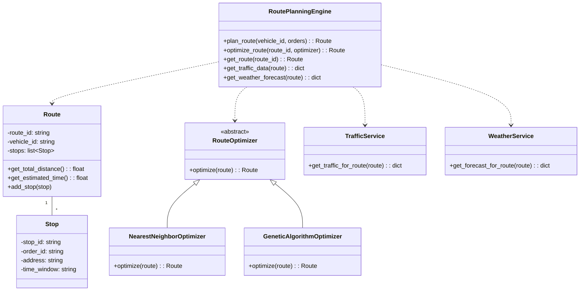

```mermaid
classDiagram
    class RoutePlanningEngine {
        +plan_route(vehicle_id, orders): Route
        +optimize_route(route_id, optimizer): Route
        +get_route(route_id): Route
        +get_traffic_data(route): dict
        +get_weather_forecast(route): dict
    }
    class Route {
        -route_id: string
        -vehicle_id: string
        -stops: list~Stop~
        +get_total_distance(): float
        +get_estimated_time(): float
        +add_stop(stop)
    }
    class Stop {
        -stop_id: string
        -order_id: string
        -address: string
        -time_window: string
    }
    class RouteOptimizer {
        <<abstract>>
        +optimize(route): Route
    }
    class NearestNeighborOptimizer {
        +optimize(route): Route
    }
    class GeneticAlgorithmOptimizer {
        +optimize(route): Route
    }
    class TrafficService {
        +get_traffic_for_route(route): dict
    }
    class WeatherService {
        +get_forecast_for_route(route): dict
    }
    RoutePlanningEngine ..> Route
    RoutePlanningEngine ..> RouteOptimizer
    RoutePlanningEngine ..> TrafficService
    RoutePlanningEngine ..> WeatherService
    Route "1" -- "*" Stop
    RouteOptimizer <|-- NearestNeighborOptimizer
    RouteOptimizer <|-- GeneticAlgorithmOptimizer
```