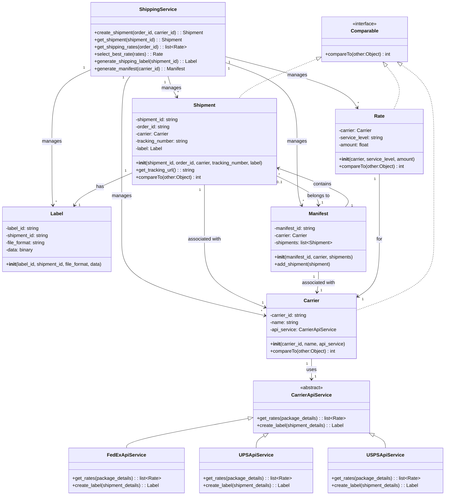

```mermaid

classDiagram
   class Comparable {
       <<interface>>
       +compareTo(other:Object) int
   }


   class ShippingService {
       +create_shipment(order_id, carrier_id): Shipment
       +get_shipment(shipment_id): Shipment
       +get_shipping_rates(order_id): list~Rate~
       +select_best_rate(rates): Rate
       +generate_shipping_label(shipment_id): Label
       +generate_manifest(carrier_id): Manifest
   }
   class Shipment {
       -shipment_id: string
       -order_id: string
       -carrier: Carrier
       -tracking_number: string
       -label: Label
       +__init__(shipment_id, order_id, carrier, tracking_number, label)
       +get_tracking_url(): string
       +compareTo(other:Object) int
   }
   class Carrier {
       -carrier_id: string
       -name: string
       -api_service: CarrierApiService
       +__init__(carrier_id, name, api_service)
       +compareTo(other:Object) int
   }
   class Rate {
       -carrier: Carrier
       -service_level: string
       -amount: float
       +__init__(carrier, service_level, amount)
       +compareTo(other:Object) int
   }
   class Label {
       -label_id: string
       -shipment_id: string
       -file_format: string
       -data: binary
       +__init__(label_id, shipment_id, file_format, data)
   }
   class Manifest {
       -manifest_id: string
       -carrier: Carrier
       -shipments: list~Shipment~
       +__init__(manifest_id, carrier, shipments)
       +add_shipment(shipment)
   }
   class CarrierApiService {
       <<abstract>>
       +get_rates(package_details): list~Rate~
       +create_label(shipment_details): Label
   }
   class FedExApiService {
       +get_rates(package_details): list~Rate~
       +create_label(shipment_details): Label
   }
   class UPSApiService {
       +get_rates(package_details): list~Rate~
       +create_label(shipment_details): Label
   }
   class USPSApiService {
       +get_rates(package_details): list~Rate~
       +create_label(shipment_details): Label
   }


   ShippingService "1" --> "*" Shipment : manages
   ShippingService "1" --> "*" Carrier : manages
   ShippingService "1" --> "*" Rate : manages
   ShippingService "1" --> "*" Label : manages
   ShippingService "1" --> "*" Manifest : manages


   Shipment "1" --> "1" Carrier : associated with
   Shipment "1" --> "1" Label : has
   Shipment "0..1" --> "1" Manifest : belongs to


   Manifest "1" --> "1" Carrier : associated with
   Manifest "1" --> "*" Shipment : contains


   Carrier "1" --> "1" CarrierApiService : uses


   CarrierApiService <|-- FedExApiService
   CarrierApiService <|-- UPSApiService
   CarrierApiService <|-- USPSApiService


   Rate "1" --> "1" Carrier : for


   Comparable <|.. Shipment
   Comparable <|.. Carrier
   Comparable <|.. Rate


```
