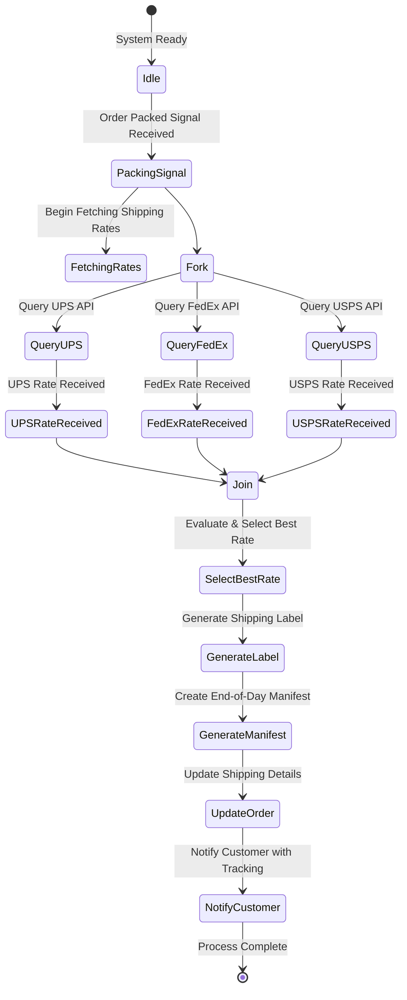

```mermaid
stateDiagram-v2
    [*] --> Idle : System Ready

    Idle --> PackingSignal : Order Packed Signal Received
    PackingSignal --> FetchingRates : Begin Fetching Shipping Rates

    %% Fork to parallel API calls to carriers
    ForkAPIQueries : Fork
    PackingSignal --> ForkAPIQueries
    ForkAPIQueries --> QueryUPS : Query UPS API
    ForkAPIQueries --> QueryFedEx : Query FedEx API
    ForkAPIQueries --> QueryUSPS : Query USPS API

    QueryUPS --> UPSRateReceived : UPS Rate Received
    QueryFedEx --> FedExRateReceived : FedEx Rate Received
    QueryUSPS --> USPSRateReceived : USPS Rate Received

    %% Join API responses before selecting best rate
    JoinAPIResponses : Join
    UPSRateReceived --> JoinAPIResponses
    FedExRateReceived --> JoinAPIResponses
    USPSRateReceived --> JoinAPIResponses

    JoinAPIResponses --> SelectBestRate : Evaluate & Select Best Rate

    SelectBestRate --> GenerateLabel : Generate Shipping Label
    GenerateLabel --> GenerateManifest : Create End-of-Day Manifest
    GenerateManifest --> UpdateOrder : Update Shipping Details
    UpdateOrder --> NotifyCustomer : Notify Customer with Tracking
    NotifyCustomer --> [*] : Process Complete
```
