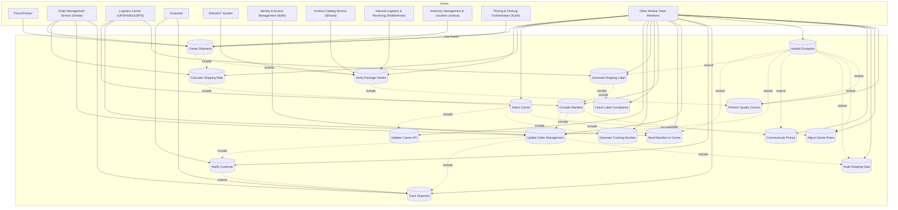

```mermaid
graph TB
    subgraph Actors
        PickerPacker["Picker/Packer"]
        OMS["Order Management Service (Omkar)"]
        Carrier["Logistics Carrier (UPS/FedEx/USPS)"]
        Customer["Customer"]
        RobotIoT["Robot/IoT System"]
        IAMService["Identity & Access Management (Nidhi)"]
        ProductCatalog["Product Catalog Service (Shivani)"]
        InboundLogistics["Inbound Logistics & Receiving (Riddhimman)"]
        InventoryManagement["Inventory Management & Location (Joshua)"]
        PickingPacking["Picking & Packing Orchestration (Kushi)"]
        OtherTeam["Other Module Team Members"]
    end
    
    subgraph Use Cases
        CS[("Create Shipment")]
        VPD[("Verify Package Details")]
        CSR[("Calculate Shipping Rate")]
        SC[("Select Carrier")]
        VCA[("Validate Carrier API")]
        GTN[("Generate Tracking Number")]
        GSL[("Generate Shipping Label")]
        CLC[("Check Label Compliance")]
        CM[("Compile Manifest")]
        SMC[("Send Manifest to Carrier")]
        UOM[("Update Order Management")]
        NC[("Notify Customer")]
        TS[("Track Shipment")]
        HE[("Handle Exception")]
        CP[("Communicate Pickup")]
        ASD[("Audit Shipping Data")]
        ACR[("Adjust Carrier Rules")]
        PQC[("Perform Quality Checks")]
    end
    
    %% Actor to Use Case Associations
    PickerPacker --> CS
    RobotIoT --> VPD
    OMS --> CS
    OMS --> CSR
    OMS --> UOM
    OMS --> TS
    Carrier --> CM
    Carrier --> SMC
    Carrier --> GSL
    Customer --> NC
    Customer --> TS
    
    %% Module Team Members
    IAMService --> UOM
    ProductCatalog --> VPD
    InboundLogistics --> VPD
    InventoryManagement --> CS
    PickingPacking --> CS
    
    %% Other Team Members
    OtherTeam --> CS
    OtherTeam --> VPD
    OtherTeam --> CSR
    OtherTeam --> SC
    OtherTeam --> VCA
    OtherTeam --> GTN
    OtherTeam --> GSL
    OtherTeam --> CLC
    OtherTeam --> CM
    OtherTeam --> SMC
    OtherTeam --> UOM
    OtherTeam --> NC
    OtherTeam --> TS
    OtherTeam --> HE
    OtherTeam --> CP
    OtherTeam --> ASD
    OtherTeam --> ACR
    OtherTeam --> PQC
    
    %% Include Relationships
    CS -.->|include| VPD
    CS -.->|include| CSR
    CSR -.->|include| SC
    SC -.->|include| VCA
    SC -.->|include| GTN
    GSL -.->|include| CLC
    GSL -.->|include| CM
    CM -.->|include| SMC
    CM -.->|include| UOM
    UOM -.->|include| NC
    UOM -.->|include| TS
    CM -.->|include| CP
    UOM -.->|include| ASD
    SC -.->|include| ACR
    VPD -.->|include| PQC
    
    %% Extend Relationships
    HE -.->|extend| SMC
    HE -.->|extend| GSL
    HE -.->|extend| UOM
    HE -.->|extend| CP
    HE -.->|extend| ASD
    HE -.->|extend| ACR
    HE -.->|extend| PQC
    NC -.->|extend| TS

```
