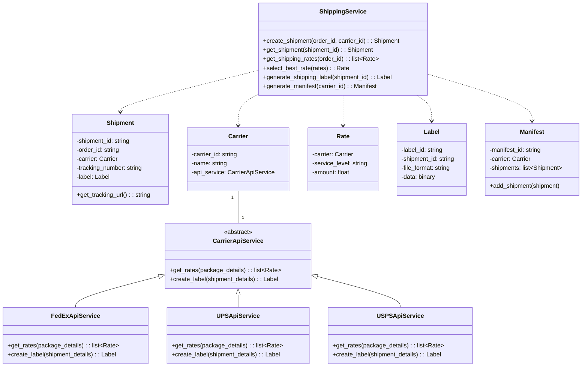

```mermaid
classDiagram
    class ShippingService {
        +create_shipment(order_id, carrier_id): Shipment
        +get_shipment(shipment_id): Shipment
        +get_shipping_rates(order_id): list~Rate~
        +select_best_rate(rates): Rate
        +generate_shipping_label(shipment_id): Label
        +generate_manifest(carrier_id): Manifest
    }
    class Shipment {
        -shipment_id: string
        -order_id: string
        -carrier: Carrier
        -tracking_number: string
        -label: Label
        +get_tracking_url(): string
    }
    class Carrier {
        -carrier_id: string
        -name: string
        -api_service: CarrierApiService
    }
    class Rate {
        -carrier: Carrier
        -service_level: string
        -amount: float
    }
    class Label {
        -label_id: string
        -shipment_id: string
        -file_format: string
        -data: binary
    }
    class Manifest {
        -manifest_id: string
        -carrier: Carrier
        -shipments: list~Shipment~
        +add_shipment(shipment)
    }
    class CarrierApiService {
        <<abstract>>
        +get_rates(package_details): list~Rate~
        +create_label(shipment_details): Label
    }
    class FedExApiService {
        +get_rates(package_details): list~Rate~
        +create_label(shipment_details): Label
    }
    class UPSApiService {
        +get_rates(package_details): list~Rate~
        +create_label(shipment_details): Label
    }
    class USPSApiService {
        +get_rates(package_details): list~Rate~
        +create_label(shipment_details): Label
    }
    ShippingService ..> Shipment
    ShippingService ..> Carrier
    ShippingService ..> Rate
    ShippingService ..> Label
    ShippingService ..> Manifest
    Carrier "1" -- "1" CarrierApiService
    CarrierApiService <|-- FedExApiService
    CarrierApiService <|-- UPSApiService
    CarrierApiService <|-- USPSApiService
```